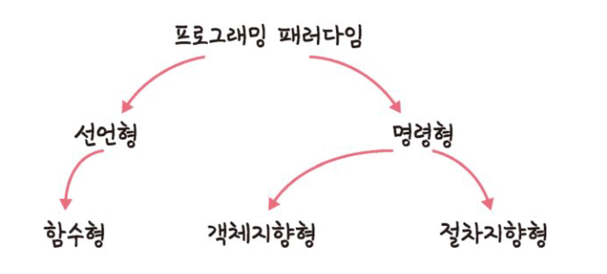

# 1. 디자인 패턴과 프로그래밍 패러다임


### 프로그래밍 패러다임이란?

- 프로그래머에게 프로그래밍의 관점을 갖게 해주는 역할을 하는 개발 방법론
- e.g. 객체지향 프로그래밍 → 프로그래머로 하여금 “프로그램 = 상호 작용하는 객체들의 집합” 으로 보게 함

- 어떤 언어는 특정한 패러다임을 지원하기도 한다.
- C++, 파이썬, 자바스크립트는 여러 패러다임 지원
- 자바 jdk 1.8 부터 여러 패러다임 지원 위해 기능 추가함

### 프로그래밍 패러다임의 분류



## 선언형과 함수형 프로그래밍


### 선언형 프로그래밍

- ‘무엇을’ 풀어내는가에 집중하는 패러다임
- “프로그램은 함수로 이루어진 것이다” 라는 명제가 담겨있는 패러다임

### 함수형 프로그래밍

- 선언형 프로그래밍의 일종

    *자연수로 이루어진 배열에서 최댓값 찾기 ver.1*
    
    ```jsx
    const list = [1, 2, 3, 4, 5, 11, 12]
    const ret = list.reduce((max, num) => num > max ? num : max, 0)
    console.log(ret) // 12
    ```
    
    - reduce() 는 순수함수
        - 배열만 받아서 누적한 결괏값을 반환
        - 즉 출력이 입력에만 의존. 매개변수가 아닌 다른 값에게 영향을 받으면 안된다.

<aside>
    
    💡 함수형 프로그래밍

    순수함수들을 블록처럼 쌓아 로직을 구현 + 고차함수를 통해 재사용성 높인 프로그래밍 패러다임

</aside>

- 함수가 일급객체이고, 단순하고 유연한 자바스크립트는 함수형 프로그래밍 방식이 적합

### 고차함수

- 함수가 함수를 매개변수로 받아 로직을 생성할 수 있는 것
- 고차함수를 쓰기 위해서는 해당 언어가 일급 객체라는 걸 전제해야 한다.
    - 변수나 메서드에 함수 할당 가능
    - 함수 안에 함수를 매개변수로 담을 수 있음
    - 함수의 리턴값으로 함수 사용 가능

## 객체지향 프로그래밍


### 개요

- 객체들의 집합으로 프로그램의 상호작용 표현
- 데이터를 객체로 취급하여 객체 내부에 선언된 메서드를 활용하는 방식
- 설계가 오래 걸리고 처리속도가 느리다.

    *자연수로 이루어진 배열에서 최댓값 찾기 ver.2*
    
    ```jsx
    const ret = [1, 2, 3, 4, 5, 11, 12]
    class List {
        constructor(list) {
            this.list = list
            this.mx = list.reduce((max, num) => num > max ? num : max, 0)
        }
        getMax() {
            return this.mx
        }
    }
    const a = new List(ret)
    console.log(a.getMax()) // 12
    ```
    
    → List 클래스 만들어서 a 객체 찍어낼 때 최댓값 추출할 수 있도록 메서드 생성함
    

### 특징

= A PIE

- 추상화 (Abstraction)
    - 실제의 복잡한 시스템으로부터 핵심적인 개념 또는 기능을 간추려 내는 것
- 다형성 (Polymorphism)
    - 하나의 메서드나 클래스가 다양한 방법으로 동작
    - e.g. 오버로딩, 오버라이딩
- 상속성 (Inheritance)
    - 상위 클래스의 특성을 하위 클래스가 재사용 및 추가, 확장하는 것
    - 재사용성, 계층적 관계의 생성, 유지 보수성 측면에서 중요
- 캡슐화 (Encapsulation)
    - 객체의 속성과 메서드를 하나로 묶고 일부를 외부에서 못 보게 은닉

- 오버로딩
    - 같은 이름을 가진 메서드를 여러 개 두는 것
    - 메서드의 타입, 매개변수 유형, 개수 등으로 구분
    - 정적 다형성 → 컴파일 중에 발생

- 오버라이딩
    - 자식 클래스가 부모 클래스의 메서드 재정의 하는 것
    - 동적 다형성 → 런타임 중에 발생

### 설계 원칙

SOLID 원칙

- 단일 책임 원칙 (Single ~)
    - 모든 클래스는 하나의 책임만 가진다
    - e.g. A라는 로직 → 어떠한 클래스는 A에 관한 클래스이고, 수정 시에도 A와 관련된 수정이어야 한다. ???
- 개방-폐쇄 원칙 (Open-Closed ~)
    - 유지 보수 사항이 생기면 코드 쉽게 확장 가능하도록
    - 수정할 때는 닫혀있도록
    - 즉, 기존 코드는 잘 변경하지 않으면서도 확장은 쉽게 할 수 있어야 한다.
- 리스코프 치환 원칙 (Liskov ~)
    - 프로그램의 객체는 프로그램의 정확성을 깨뜨리지 않으면서, 하위 타입의 인스턴스로 바꿀 수 있어야 한다.
    - 부모 객체에 자식 객체를 넣어도 시스템 문제 없도록 해야 한다.
    - 다형성???
- 인터페이스 분리 원칙 (Interface ~)
    - 하나의 일반적인 인터페이스보다 구체적인 여러 개의 인터페이스를 만들어라.
- 의존 역전 원칙 (Dependency ~)
    - 추상화된 인터페이스나 상위 클래스를 만들어서 변하기 쉬운 것의 변화에 영향 받지 않도록 해야한다.
    - 즉, 상위 계층은 하위 계층의 변화에 대한 구현으로부터 독립적이어야 한다.

## 절차형 프로그래밍


### 특징

- 로직 = 수행되어야 할 연속적인 계산 과정
- 일이 진행되는 방식 그대로 코드를 구현하기 때문에, 가독성이 좋고 실행 속도가 빠르다.
- 계산이 많은 작업 등에 쓰인다
    - e.g. 대기 과학 관련 연산, 머신러닝의 배치 작업
- 하지만 모듈화가 어렵고 유지보수성이 떨어진다.

    *자연수로 이루어진 배열에서 최댓값 찾기 ver.3*

    ```jsx
    const ret = [1, 2, 3, 4, 5, 11, 12]
    let a = 0
    for(let i = 0; i < ret.length; i++){
        a = Math.max(ret[i], a) // 순서대로 다 비교
    } 
    console.log(a) // 12
    ```
    

## 패러다임의 혼합


### 어떤 패러다임을 선택해야 하는가?

- 비즈니스 로직이나 서비스의 특징을 고려해서 정해라
- 여러 패러다임을 조합하여 상황과 맥락에 따라 장점만 취해 개발하는 것이 베스트

*e.g. 머신러닝 파이프라인은 절차 지향형 패러다임 + 거래 관련 로직은 함수형 프로그래밍*
