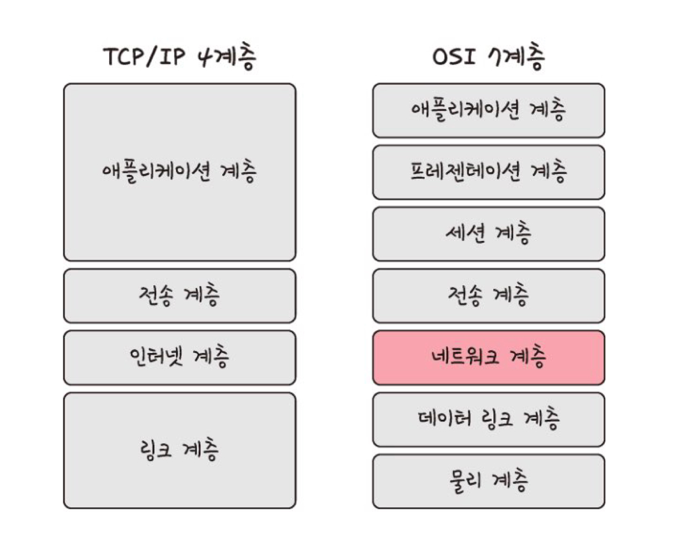
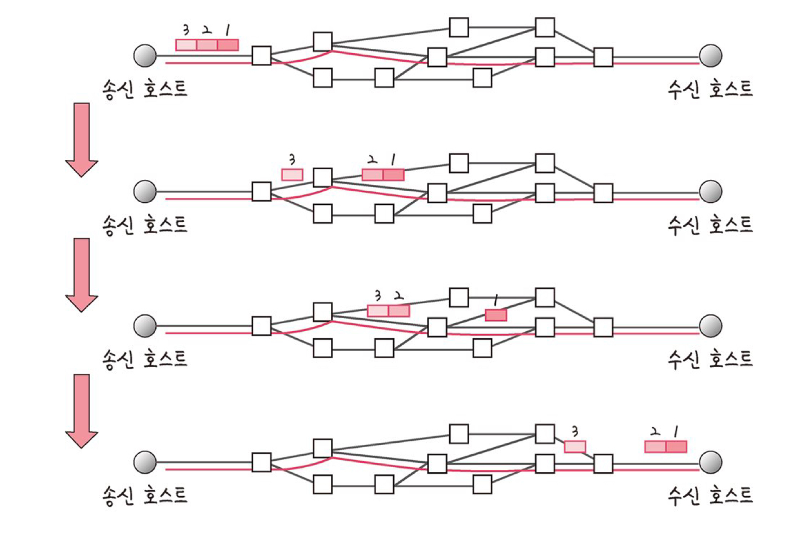
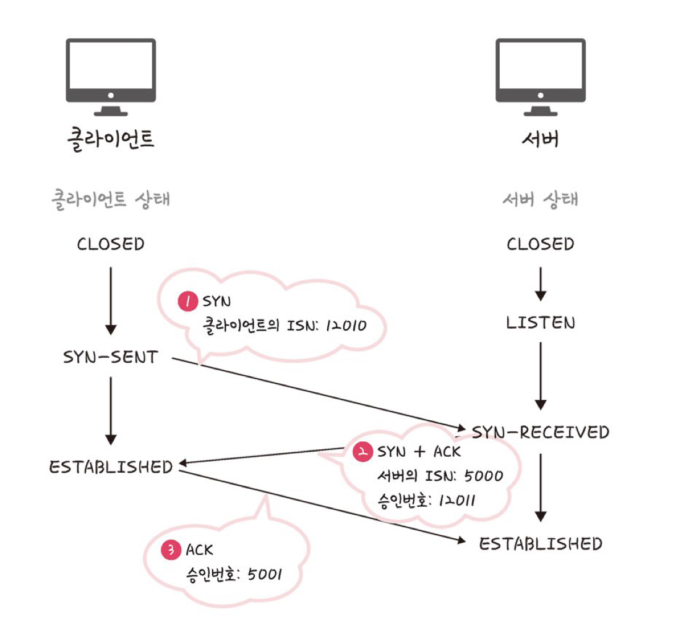
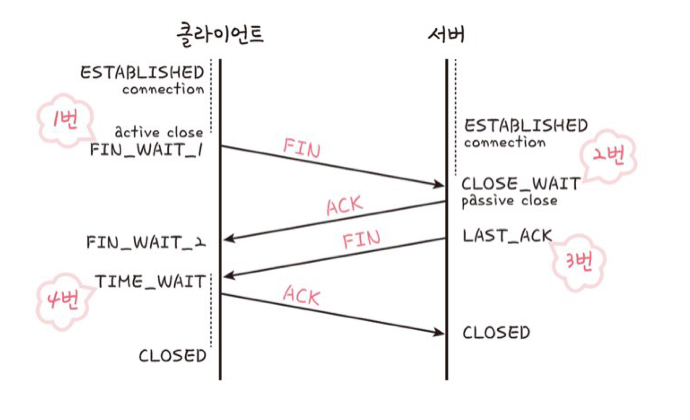

# 2. 네트워크

## 개요

**인터넷 프로토콜 스위트(Internet protocol suite)** 는 TCP/IP 4계층 모델 혹은 OSI 7계층 모델로 설명한다.

- 인터넷에서 컴퓨터들이 서로 정보를 주고받는 데 쓰이는 프로토콜의 집합

- TCP/IP 4계층 모델
    - 계층들은 프로토콜의 네트워킹 범위에 따라 4개의 추상화 계층으로 구성된다.
    - 특정 계층이 변경되었을 때 다른 계층이 영향을 받지 않도록 설계되었다.
    - 7계층 모델과의 차이? 애플리케이션 계층을 7계층 모델에서는 3개의 계층으로 쪼갬

## 계층 구조

### 애플리케이션 계층

- 계층을 대표하는 스택 : FTP, HTTP, SSH, SMTP, DNS
    - FTP(File Transfer Protocol) : 장치 간 파일을 전송하는 데 사용하는 표준 통신 프로토콜
    - HTTP : WWW를 위한 데이터 통신의 기초이자 웹 사이트 이용시 사용하는 프로토콜
    - SSH(Secure Shell) : 암호화 네트워크 프로토콜
    - SMTP(Simple Mail Transfer Protocol) : 전자메일 전송을 위한 인터넷 표준 통신 프로토콜 (Mail)
    - DNS(Domain Name System) : 도메인 이름과 IP 주소를 매핑해주는 서버. IP 주소 달라져도 똑같은 도메인 주소로 서비스 할 수 있게 함
- 응용 프로그램이 사용되는 프로토콜 계층
- 서비스를 사람들에게 실질적으로 제공

### 전송 계층

- 계층을 대표하는 스택 : TCP, UDP, QUIC
- 송신자와 수신자를 연결하는 통신 서비스 제공
    - 애플리케이션과 인터넷 계층 사이의 데이터 전달 시 중계 역할
- 연결 지향 데이터 스트림 및 신뢰성과 흐름 제어 제공

**TCP와 UDP 비교**

- TCP
    - 패킷 사이의 순서 보장
    - 연결지향 프로토콜 사용하여 연결
    - 신뢰성을 구축해서 수신 여부 확인 → 신뢰성이 있는 계층
    - **가상회선 패킷 교환** **방식** 사용
    
    <aside>

        💡 가상회선 패킷 교환 방식
        
        - 각 패킷에 가상회선 식별자가 포함된다.
        - 모든 패킷을 전송하면 가상회선 해제 + 패킷들 전송된 순서대로 도착
        - 아래 그림에서 빨간 선이 가상회선
    
    
    
    
    </aside>
    
- UDP
    - 순서 보장 x
    - 수신 여부 확인 x
    - 신뢰성이 없는 계층
    - 단순히 데이터만 제공 → **데이터그램 패킷 교환 방식** 사용
    
    <aside>

        💡 데이터그램 패킷 교환 방식
        
        - 패킷은 독립적으로 각자 최적의 경로를 선택해서 이동
        - 하나의 메시지에서 분할된 여러 패킷들은 서로 다른 경로로 전송될 수 있고 + 도착 순서 또한 다를 수 있다.

    </aside>
    

**TCP의 연결 성립 과정**

- 신뢰성 확보를 위해 `3-웨이 핸드셰이크` 작업 진행 → 이후에 데이터 전송 시작

1. SYN 단계
    - 연결 요청 플래그
    - 클라이언트가 클라이언트의 ISN을 담아 서버에 SYN 보내는 단계
        - ISN : TCP 연결의 첫번째 패킷에 할당된 임의의 시퀀스 번호
2. SYN + ACK 단계
    - 서버 수신 및 서버의 ISN과 `클라이언트의 ISN+1` 을 승인번호로 보낸다.
3. ACK 단계
    - 응답 플래그
    - 클라이언트는 `서버 ISN+1` 을 승인번호로 담아 응답 플래그를 서버에 보냄

**TCP의 연결 해제 과정**

- `4-웨이 핸드셰이크` 과정 발생
- FIN 플래그 사용

<aside>

    💡 TIME_WAIT 상태
    - 지연 패킷 발생 대비
        - 패킷이 뒤늦게 도달하여 처리하지 못한다면 데이터 무결성 문제
    - 두 장치가 연결이 닫혔는지 확인하기 위해
        - LAST_ACK 상태에서 닫히면 새로운 연결 시 접속 오류 발생

        

</aside>

1. 클라이언트가 close() 하려고 할 때 서버에게 알리기 위해 FIN 플래그를 보낸다.
    - 클라이언트는 FIN_WAIT_1 상태
2. 서버는 ACK라는 승인 세그먼트를 보낸다.
    - 서버는 CLOSE_WAIT 상태
    - 클라이언트가 ACK 받으면 FIN_WAIT_2 상태
3. 서버는 일정 시간 이후 클라이언트에 FIN 세그먼트 전송
4. 클라이언트는 `TIME_WAIT` 상태 + 서버로 ACK 세그먼트 전송 → 서버 CLOSED 상태
    - 이후 클라이언트 일정 시간 지나고 연결 닫힘
    - 모든 자원 연결 해제 완료

### 인터넷 계층

- 계층을 대표하는 스택 : IP, ARP, ICMP
- 장치로부터 받은 네트워크 패킷을 지정된 목적지로 전송하기 위해 사용
- 패킷 수신해야 할 상대의 주소를 지정하여 데이터 전달
- 수신 보장 하지 않는 비연결형적인 특징이 있다.

### 링크 계층

= 네트워크 접근 계층

- 계층을 대표하는 스택 : 이더넷
- 전선, 광섬유, 무선 등을 사용해 실질적으로 데이터를 전달
- 장치 간의 신호를 주고 받는 규칙을 정하는 계층

- 물리 계층과 데이터 링크 계층으로 나누기도 한다.
    - 물리 계층 : 0과 1로 이루어진 데이터를 보냄
    - 데이터 링크 계층 : 이더넷 프레임을 통해 에러 확인, 흐름 제어, 접근 제어 담당

**유선 LAN**

- 유선 LAN을 이루는 이더넷은 IEEE802.3 프로토콜 따른다.
- 전이중화 통신
    - 양쪽 장치가 동시에 송수신 가능
    - 송신로 수신로 나누어져 있음
    - 현대의 고속 이더넷에서 채택하는 방식
- CSMA/CD 방식
    - 예전에 사용
    - 반이중화 통신의 일종
        - 데이터를 보냈는데 충돌 발생시 일정 시간 이후 재전송하는 방식
        - 경로가 하나이기 때문에 충돌에 대비해야 해서 사용
- 트위스트 페어 케이블, 광섬유 케이블 이 대표적
    - 트위스트 페어 케이블
        - 8개의 구리선을 2개씩 꼬아서 묶은 케이블
        - 구리선을 실드 처리한 경우 STP, 아닌 경우 UTP(LAN 케이블)
    - 광섬유 케이블
        - 광섬유로 만든 케이블
        - 레이저를 이용해서 통신하기 때문에 장거리 및 고속 통신 가능
        - 광섬유 내부와 외부를 다른 밀도의 섬유로 제작해, 반사와 굴절의 원리로 이동

**무선 LAN**

- 반이중화 통신 사용
- CSMA/CA 는 반이중화 통신의 일종
    - 작동방식
    1. 송신 전 무선 매체를 살피고, 캐리어 감지를 통해 회선이 비어있는지 판단한다.
    2. 랜덤 시간만큼 기다린다. 무선 매체가 사용 중이라면 대기 시간 간격을 늘려가며 기다린다. → IFS 방식
    3. 데이터를 송신한다.

**무선 LAN을 이루는 주파수**

- 무선 LAN은 무선신호 전달 방식으로 2대 이상의 장치를 연결하는 기술
- 비유도 매체(물리적 도체 없이 신호를 전달하는 매체) 인 공기에 주파수를 쏘아서 무선 통신망을 구축한다.
- 주파수 대역은 2.4GHz 와 5GHz 대역 이 있다.
    - 전자는 장애물에 강하지만 전파 간섭이 많다.
    - 일반적으로 전파 환경을 깨끗하게 구축할 수 있는 후자를 사용한다.

- 와이파이
    - 무선 접속 장치 (AP, 공유기) 필요
    - 유선 LAN의 신호를 무선 LAN으로 바꿔준다.
- BSS
    - 기본 서비스 집합
    - 동일 BSS 내의 AP와 장치들이 서로 통신 가능
    - 근거리 무선 통신 제공
    - 하나의 AP 기반으로 구축되어있어, 이동하며 접속은 불가능
- ESS
    - 하나 이상 연결된 BSS 그룹
    - 장거리 무선 통신 제공
    - BSS보다 가용성, 이동성 높음 → 이동하면서도 네트워크 연결 가능

**이더넷 프레임**

- 전달받은 데이터의 에러를 검출하고 캡슐화하는 데 사용
- 구조
    
    
    
    - Preamble : 이더넷 프레임의 시작을 알림
    - SFD : 다음 바이트부터 MAC 주소 필드 시작임을 알림
    - DMAC, SMAC : 수신, 송신 **MAC 주소**(LAN 카드 식별번호)
    - EtherType : IP 프로토콜 정의 → IPv4 또는 IPv6
    - Payload : 전달받은 데이터
    - CRC : 에러 확인 비트

### 계층간 데이터 송수신 과정

*e.g. HTTP를 통해 웹 서버에 있는 데이터를 요청한다면?*

→ `애플리케이션계층` <캡슐화> `전송계층`  `인터넷계층`  `링크계층` (클라이언트) <서버와 통신> (서버) `링크계층` <비캡슐화> `인터넷계층`  `전송계층`  `애플리케이션계층`

- 캡슐화 과정
    
    : 상위 계층의 헤더와 데이터를 하위 계층의 데이터 부분에 포함시키고, 해당 계층의 헤더를 삽입하는 과정
    
    - 애플리케이션 → 전송 : 세그먼트, 데이터그램화
    - 전송 → 인터넷 : 패킷화
    - 인터넷 → 링크 : 프레임 헤더와 프레임 트레일러가 붙는 프레임화

- 비캡슐화 과정
    
    : 하위 계층 > 상위 계층으로 가며 각 계층의 헤더 부분을 제거하는 과정
    
    - 링크 → 인터넷 : 패킷화
    - 인터넷 → 전송 : 세그먼트, 데이터그램화
    - 전송 → 애플리케이션 : 메시지화
    - 최종적으로 사용자에게 애플리케이션의 PDU(프로토콜 데이터 단위)인 메시지로 전달됨

## PDU

- 네트워크의 특정 계층에서 다른 계층으로 데이터가 전달될 때 한 덩어리의 단위
- 제어 관련 정보가 포함된 `헤더`, 데이터를 의미하는 `페이로드`로 구성
- 계층마다 부르는 명칭 다르다
    - e.g. 애플리케이션 → 메시지 / 전송 → 세그먼트, 데이터그램 …
- 애플리케이션 계층은 메시지 기반으로 데이터 전달 → HTTP 헤더가 문자열

- curl 명령어로 PDU 테스팅
    - www.naver.com 으로 HTTP 요청
    - `curl [www.naver.com](http://www.naver.com)` 하면 응답 헤더 값 모두 문자열로 나온다.

- 가장 아래 계층인 비트로 송수신하는 것이 가장 빠르고 효율성이 높다.
- 하지만 애플리케이션 계층은 예외적으로 문자열을 기반으로 송수신한다.
    - 헤더에 authorization 값 등을 넣는 확장이 쉬워서