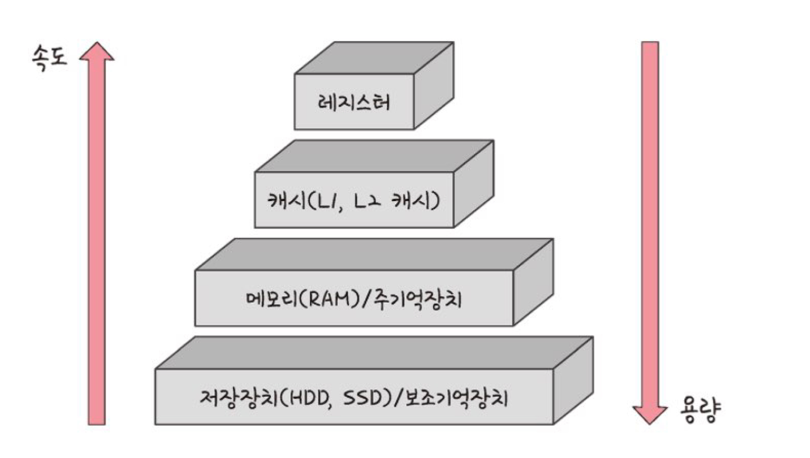
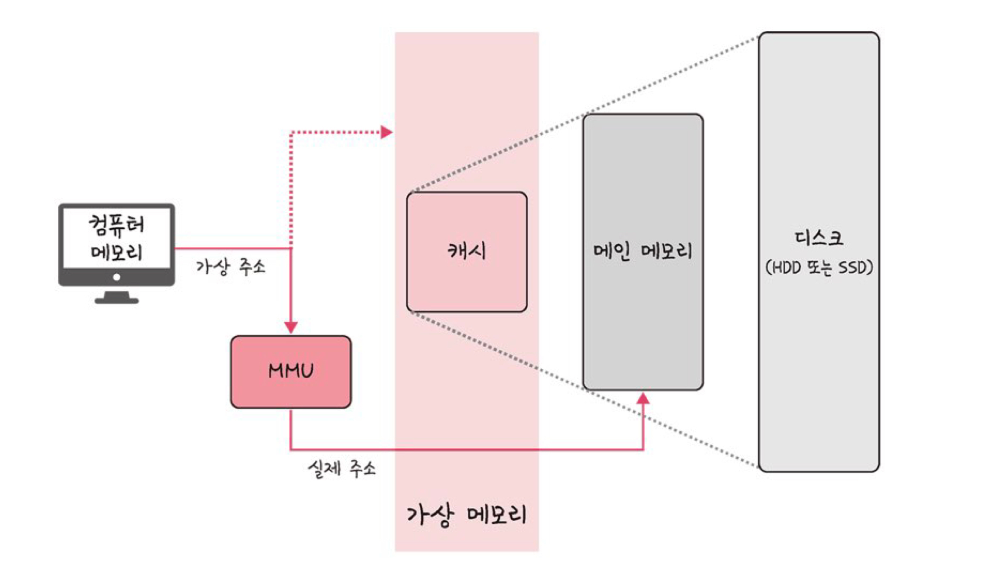
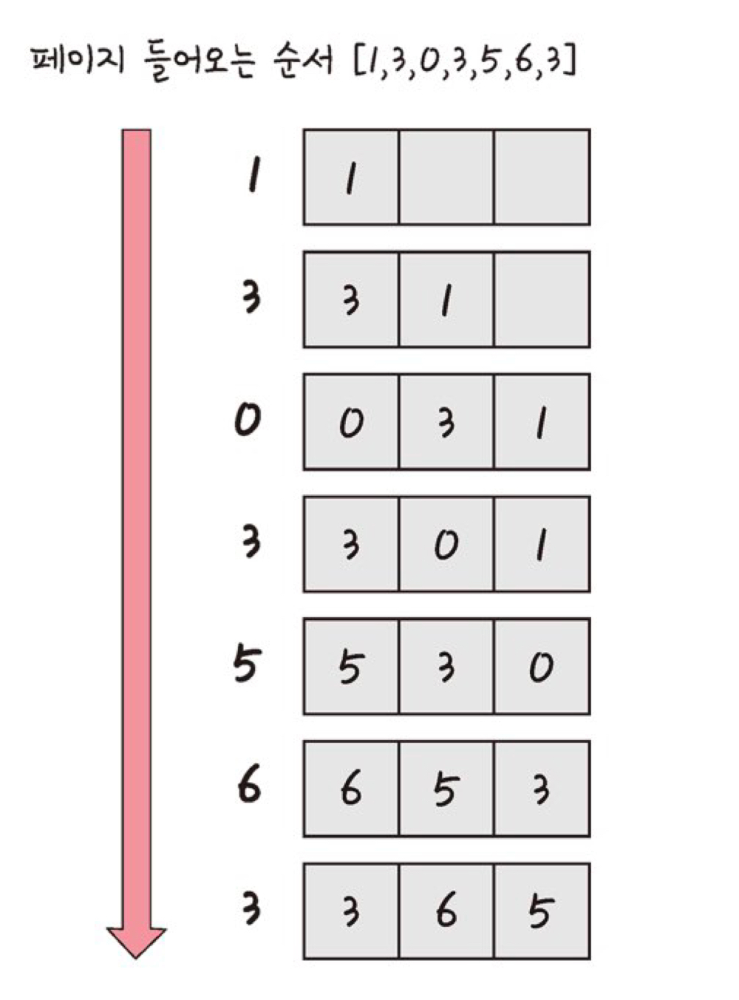

# 5주차 - 메모리

[메모리 계층](#메모리-계층)  
[메모리 관리](#메모리-관리)

## 메모리 계층

### 메모리 계층의 구성

레지스터 + 캐시 + 메모리 + 저장장치



- 레지스터 : CPU 내부의 작은 메모리
- 캐시 : L1, L2 캐시
- 주기억장치 : RAM
    - 하드디스크로부터 일정량의 데이터를 복사하여 임시 저장하고, 필요시 CPU에 빠르게 전달함
- 보조기억장치(유일한 **비휘발성**) : HDD, SSD

*+) 속도가 빠를 수록 가격이 비쌈*

### 캐시

- 데이터를 미리 복사해 놓는 임시 저장소
    - 데이터를 접근하는 시간이 오래 걸리는 경우를 해결
    - 무언가를 또 다시 계산하는 시간을 절약
- 빠른 장치와 느린 장치 간 속도 차이에 의한 병목 현상을 줄이기 위한 메모리
    
    <aside>
        
        💡 캐싱 계층
        
        : 속도 차이 해결 위해 계층 사이에 존재하는 계층
        
        e.g. 메모리와 CPU 간 속도 차이가 너무 크기 때문에, 레지스터 계층을 중간에 둬서 해결
        
        e.g. 캐시 메모리와 보조기억장치 사이에 있는 주기억장치
    
    </aside>
    

**지역성의 원리**

- 캐시를 직접 설정할 때는 자주 사용하는 데이터를 기반으로 설정한다.
    - 자주 사용한다? **지역성**을 근거로 판단
- 시간 지역성
    - 최근 사용한 데이터에 다시 접근하려는 특성
- 공간 지역성
    - 최근 접근한 데이터를 이루는 공간이나 그 가까운 공간에 접근하는 특성
    - 공간 = 배열 등

### 캐시히트와 캐시미스

- 캐시히트
    - 캐시에서 원하는 데이터를 찾은 경우
    - 제어장치를 거쳐 가져온다.
    - 위치 가까움 + CPU 내부 버스 기반으로 작동하기 때문에 속도 빠름
- 캐시미스
    - 원하는 데이터가 캐시에 없어서 주메모리로 가서 데이터를 찾아오는 것
    - 시스템 버스를 기반으로 작동하기 때문에 속도 느림

<br>

- 캐시매핑
    - 캐시가 히트되기 위해 매핑하는 방법
    - CPU의 레지스터와 RAM 간 데이터를 주고받을 때를 기반으로 함
    - 레지스터와 RAM의 크기 차이가 크기 때문에, 레지스터가 캐시 계층으로써 역할을 잘 하려면 캐시매핑이 중요  
        
- 캐시매핑의 분류
    - 직접 매핑
        - 캐시 1에 메모리 1~10 매핑, 캐시 2에 메모리 1~20 매핑 이런 식
        - 처리가 빠르지만 충돌 발생이 잦음
    - 연관 매핑
        - 순서 상관없이 관련있는 캐시와 메모리를 매핑
        - 충돌이 적지만 모든 블록을 탐색해야 해서 속도가 느리다.
    - 집합 연관 매핑
        - 직접 매핑 + 연관 매핑
        - 순서는 일치시키지만, 집합을 둬서 저장(블록화) → 검색 효율적
        - 캐시 1~5에 메모리 1~50의 데이터 무작위로 저장

### 웹 브라우저의 캐시

소프트웨어의 대표적인 캐시 → 웹 브라우저의 쿠키, 로컬 스토리지, 세션 스토리지

- 보통 사용자의 커스텀 정보나 인증 모듈 관련 사항 저장
- 서버 요청 시 아이덴티티나 중복 요청 방지 위해 사용

- 쿠키
    
    : 만료기한이 있는 키-값 저장소
    
    - same site 옵션을 strict 로 하지 않으면, 다른 도메인에서 요청했을 때 자동 전송
    - 4KB 까지 저장이 가능하며, 만료기한 지정 가능 (보통 서버에서 지정)
    - 쿠키 설정 시 document.cookie로 볼 수 없게 `httponly` 옵션을 걸어야 한다.
    
- 로컬 스토리지
    
    : 만료기한이 없는 키-값 저장소
    
    - 10MB 까지 저장이 가능
    - 도메인 단위로 저장 및 생성되며, 웹 브라우저 닫아도 유지된다.
    - 클라이언트에서만 수정 가능

- 세션 스토리지
    
    : 만료기한이 없는 키-값 저장소
    
    - 5MB까지 저장 가능
    - 탭 단위로 생성하며, 탭을 닫으면 삭제된다
    - 클라이언트에서만 수정 가능

### 데이터베이스의 캐싱 계층

데이터베이스 시스템 구축할 때도 메인 DB 위에 **레디스(redis) 데이터베이스 계층**을 캐싱 계층으로 둬서 성능 향상 시키기도 함

## 메모리 관리

대표적으로 운영체제가 할 일

### 가상메모리

: 컴퓨터가 실제로 이용 가능한 메모리 자원을 추상화하여 사용자들로 하여금 매우 큰 메모리로 보이게 한다.



- 가상적으로 주어진 가상 주소는 MMU(메모리 관리 장치)에 의해 실제 주소로 변환된다.
    - 사용자는 실제 주소를 의식할 필요 없이 프로그램 구축 가능
- 가상메모리는 페이지 테이블로 관리된다.
    - 가상 주소와 실제 주소가 매핑되어 있고, 프로세스의 주소 정보가 들어있음
    - 속도 향상 위해 TLB 사용

    <br>
    
    <aside>

        💡 TLB
        
        메모리와 CPU 사이에 있는 주소 변환 위한 캐시
        
        페이지 테이블에 있는 리스트를 보관하여 CPU가 페이지 테이블까지 갈 필요 없게 함
    
    </aside>
    
- 스와핑
    
    : 메모리에서 당장 사용하지 않는 영역을 하드디스크로 옮기고, 하드디스크의 일부분을 마치 메모리처럼 불러와 사용하는 것
    
    - 페이지 폴트 일어나지 않은 것처럼 만들기 위해 스와핑 사용
    
    <aside>
        
        💡 페이지 폴트
        
        프로세스의 주소 공간(가상 메모리)에는 존재하지만, 실제 메모리(RAM)에는 존재하지 않는 데이터나 코드에 접근했을 경우 발생
    
    </aside>
    

- 페이지 폴트와 스와핑 과정
    1. CPU가 물리 메모리를 확인해서 해당 페이지가 없으면, 트랩을 발생시켜 운영체제에 알린다.
    2. 운영체제가 CPU 동작 잠시 멈추게 함
    3. 운영체제가 페이지 테이블 확인해서 가상 메모리에 페이지가 존재하는지 확인
        1. 없으면 프로세스 중단하고, 현재 물리 메모리에 비어있는 프레임 있는지 탐색
        2. 물리 메모리에도 없다면 스와핑 발동
    4. 비어 있는 프레임에 해당 페이지 로드 및 페이지 테이블 최신화
    5. CPU 재시작
    
    <aside>
        
        💡 페이지와 프레임
        
        전자는 가상 메모리를 사용하는 최소 크기 단위, 후자는 실제 메모리를 사용하는 최소 크기 단위
    
    </aside>
    

### 스레싱

- 메모리의 페이지 폴트율이 높은 것
- 컴퓨터의 심각한 성능 저하를 초래한다.

- 발생원인
    - 메모리에 너무 많은 프로세스가 동시에 올라가 스와핑이 많이 일어나서
    - 페이지 폴트 → CPU 이용률 낮아짐 → 운영체제가 CPU가 하는 일이 적다고 판단하여 CPU 가용성 높이기 위해 더 많은 프로세스를 메모리에 올림 → …  → …
    - 위 악순환이 반복되며 스레싱 발생

- 해결 방법
    - 메모리를 늘리거나, HDD를 SDD로 바꾸기
    - 작업세트나 PFF 사용
    
    <aside>
        
        💡 작업세트
        
        - 프로세스의 과거 사용 이력인 **지역성을 통해 결정된 페이지 집합**을 만들어서 미리 메모리에 로드
        - 탐색에 드는 비용 감소, 스와핑 감소 효과
        
        PFF (Page Fault Frequency)
        
        - 상한선, 하한선 만들어서 페이지 폴트 빈도를 조절한다.
        - 상한선 도달 시 프레임을 늘리고 하한선 도달 시 프레임을 줄인다.

    </aside>
    

### 메모리 할당

- 메모리에 프로그램 할당 시 시작 메모리 위치, 메모리의 할당 크기 기준으로 할당한다.
- 연속 할당과 불연속 할당으로 구분됨

**연속 할당**

- 메모리에 프로세스를 순차적으로, 연속적인 공간을 할당

- 고정 분할 방식
    - 메모리를 미리 나누어 관리
    - 융통성이 없고, 내부 단편화 발생
- 가변 분할 방식
    - 매 시점 프로그램의 크기에 맞게 동적으로 메모리 분할하여 사용
    - 내부 단편화는 x, 외부 단편화 발생 가능
        
        
        <aside>
            
            💡 내부 단편화
            
            메모리를 나눈 크기보다 프로그램이 작아서 들어가지 못하는 공간이 많이 발생하는 현상
        
        </aside>
        
        <aside>
            
            💡 외부 단편화
            
            메모리를 나눈 크기보다 프로그램이 커서 들어가지 못하는 공간이 많이 발생하는 현상
        
        </aside>
        
    - 최초적합, 최적적합, 최악적합 방식으로 구분된다.
    
    | 가변 분할 분류 | 작동 방식 |
    |:-------:|:---:|
    | 최초적합 | 위쪽이나 아래쪽부터 시작. 홀 찾으면 바로 할당|
    | 최적적합 | 프로세스의 크기보다 큰 공간 중 가장 작은 홀부터 할당 |
    | 최악적합 | 프로세스의 크기와 가장 차이가 많이 나는 홀에 할당 |
    
    *+) 홀 : 할당할 수 있는 비어있는 메모리 공간*
    

**불연속 할당**

- 메모리를 연속적으로 할당하지 x
- 현대 운영체제가 채택
- 대표적으로 **페이징** 기법이 있고, 그 외에 세그멘테이션, 페이지드 세그멘테이션 등이 있다.

- 페이징
    - 메모리를 동일한 크기의 페이지(보통 4KB)로 나누고, 프로그램마다 페이지 테이블을 두어 이를 통해 메모리에 프로그램을 할당
    - 홀의 크기가 균일하지 않은 문제는 해결하지만, 주소 변환이 복잡함
- 세그멘테이션
    - 페이지 단위 x 의미 단위인 세그먼트로 구분
    - 코드, 데이터 및 함수 단위로도 나눌 수 있다.
    - 공유와 보안 측면에서 우수하지만, 홀 크기가 균일하지 않다는 문제 발생
- 페이지드 세그멘테이션
    - 공유나 보안은 의미 단위 세그먼트로, 물리적 메모리는 페이지로 나눈다.

### 페이지 교체 알고리즘

스와핑이 많이 일어나지 않도록 설계하기 위해, 페이지 교체 알고리즘 기반으로 스와핑

- 오프라인 알고리즘
    - 먼 미래에 참조되는 페이지와 현재 할당하는 페이지를 바꾸는 알고리즘
    - 가장 좋은 방법이지만, 먼 미래에 참조되는 페이지를 알 수 없어 사용할 수 없는 알고리즘
    - 다른 알고리즘과의 성능 비교에 대한 기준을 제공하는 데에 의미가 있음
- FIFO
    - 선입선출
    - 가장 먼저 온 페이지를 교체 영역에 가장 먼저 놓는 방법
- LRU
    - 새로 페이지가 들어왔을 때, 참조가 가장 오래된 페이지와 바꾼다
    - 오래되었는지 여부를 파악하기 위해 각 페이지마다 계수기, 스택을 둬야 한다는 단점이 있다.
    
        
    
    - 프로그래밍으로 구현할 때는 보통 해시 테이블 + 이중 연결 리스트 자료구조로 구현
        - 해시 테이블은 이중 연결 리스트에서 빠르게 찾을 수 있도록 한다.
        - 이중 연결 리스트는 한정된 메모리를 나타낸다.
    
    - C++ 구현 예시
        
        ```cpp
        #include <bits/stdc++.h>
        using namespace std; 
        //list는 캐시를 뜻함.
        //hash는 들어왔을 때 
        //해당 페이지가 있는지 없는지를 
        //빠르게 체크해서 해당부분을 erase하는 역할을 함.
        class LRUCache { 
        		// 이중 연결 리스트
            list<int> li;
        		// 해시테이블
            unordered_map<int, list<int>::iterator> hash;
            int csize;  
        public:
            LRUCache(int);
            void refer(int);
            void display();
        };
        LRUCache::LRUCache(int n){
            csize = n;
        }
        void LRUCache::refer(int x){ 
            //해시에 들어오는 페이지에 해당하는 값이 없을 때
            if (hash.find(x) == hash.end()) { 
                if (li.size() == csize) { 
                    // 가장 끝에 있는 것을 뽑아낸다. 
                    // 이는 가장 오래된 것을 의미한다.
                    int last = li.back(); 
                    li.pop_back(); 
                    hash.erase(last);
                }
            }else { 
                cout << "지웁니당! : " << distance(li.begin(), hash[x]) << "번째 " << *hash[x] << '\n';
                li.erase(hash[x]);
            } 
            // 해당 페이지를 참조할 때 
            // 가장 앞에 붙인다. 또한 이를 해시테이블에 저장한다.
            li.push_front(x);
            hash[x] = li.begin();
        } 
        void LRUCache::display(){
            for (auto it = li.begin(); it != li.end(); it++){
                cout << (*it) << " ";
            } 
            cout << "\n";
        } 
        int main(){
            LRUCache ca(3); 
            ca.refer(1);
            ca.display(); 
            ca.refer(3);
            ca.display();  
            ca.refer(0);
            ca.display(); 
            ca.refer(3);
            ca.display();  
            ca.refer(5);
            ca.display();  
            ca.refer(6);
            ca.display();  
            ca.refer(3);
            ca.display(); 
            return 0;
        } 
        /*
        1
        3 1
        0 3 1
        3 0 1
        5 3 0
        6 5 3
        3 6 5
        */
        ```
        

- NUR
    
    Not Used Recently
    
    - 일명 clock 알고리즘
    - LRU 에서 발전
    - 작동 방식
        1. 0과 1을 가진 비트를 둔다.
            1. 1 = 최근에 참조됨 / 0 = 참조되지 않음
        2. 시계 방향으로 돌면서 0을 찾는다.
        3. 찾게 되면 해당 프로세스를 교체 및 1로 변환

- LFU
    
    Least Frequently Used
    
    - 가장 참조 횟수가 적은 페이지를 교체한다.
    - 많이 사용되지 않아서