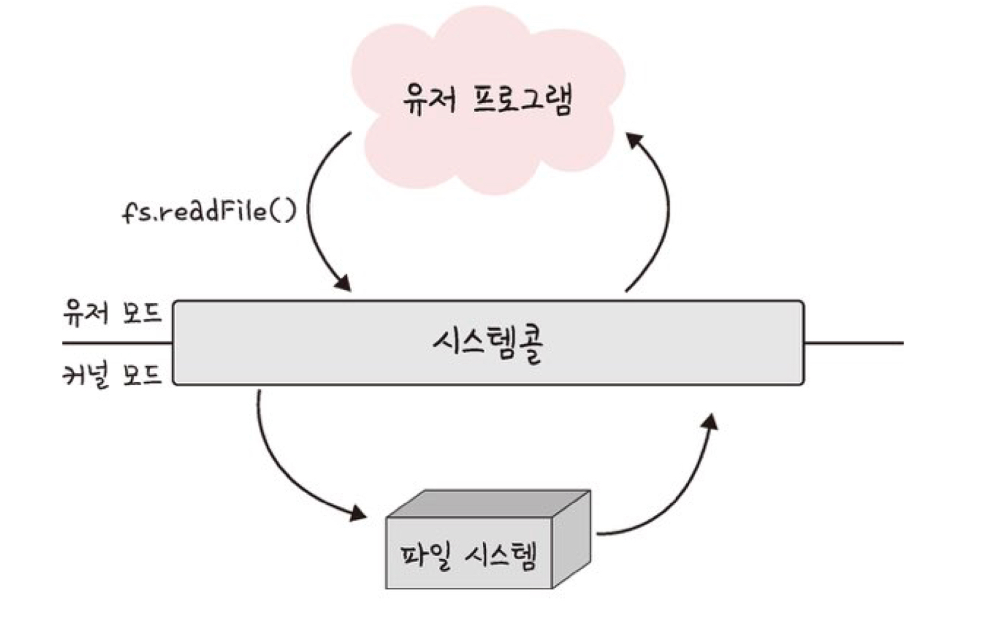
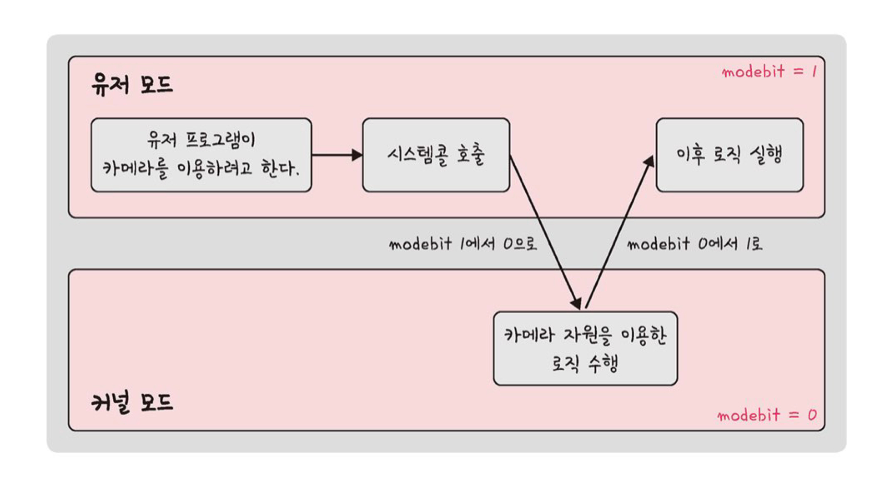
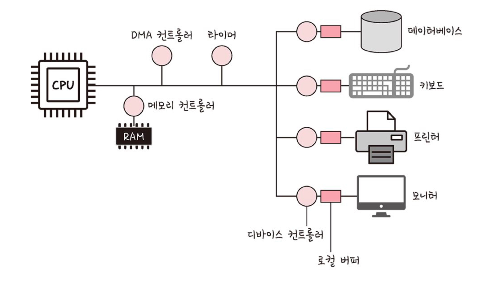

# 3. 운영체제

[운영체제의 역할과 구조](#운영체제의-역할과-구조)  
[컴퓨터의 요소](#컴퓨터의-요소)

## 운영체제의 역할과 구조

### 운영체제(OS)란?

: 사용자가 컴퓨터를 쉽게 다루게 해주는 인터페이스

- 한정된 메모리나 시스템 자원을 효율적으로 분배
- 하드웨어와 소프트웨어(유저 프로그램)를 관리

*cf. 펌웨어 : 소프트웨어를 추가로 설치할 수 없다는 점에서 다르다.*

### 운영체제의 역할

크게 4가지가 있다.

1. CPU 스케줄링과 프로세스 관리
    1. CPU의 소유권을 어떤 프로세스에 할당할지
    2. 프로세스의 생성, 삭제, 자원 할당 및 반환 관리
2. 메모리 관리 → 어떤 프로세스에 메모리를 얼마나 할당할지
3. 디스크 파일 관리 → 어떤 방법으로 보관할지
4. I/O 디바이스 관리 → 마우스, 키보드 등과 컴퓨터 간 데이터 주고 받는 것을 관리

### 운영체제의 구조

- GUI 가 없고 CUI 만 있는 리눅스 서버도 있다.

<aside>
💡 GUI 와 CUI

둘 다 사용자가 전자장치와 상호작용할 수 있도록 하는 사용자 인터페이스의 한 형태

전자는 단순 명령어 창이 아닌, 아이콘을 마우스로 클릭하여 상호작용할 수 있도록 한다.

후자는 그래픽이 아닌 명령어로 처리하는 인터페이스

</aside>

**드라이버**

: 하드웨어를 제어하기 위한 소프트웨어

**시스템콜**

- 운영체제가 **커널에 접근**하기 위한 인터페이스
- 유저 프로그램이 운영체제의 서비스를 받기 위해 커널함수를 호출할 때 사용

- 유저 프로그램이 I/O 요청으로 트랩을 발동하는 경우, 올바른 요청인지 확인한 후 유저 모드가 시스템콜을 통해 커널모드로 변환하여 실행
    - I/O 요청 : 입출력 함수, 데이터베이스, 네트워크, 파일 접근 등에 관한 일
    - *e.g. `fs.readFile()` (파일 읽는 함수, I/O 요청의 일종) 발동 시*

     
    
    

    → 유저 모드에서 파일 읽지 않고 커널 모드에서 읽고, 다시 유저 모드로 돌아가 그 뒤의 로직을 수행한다.
    
    → 장점) 컴퓨터 자원에 대한 직접 접근을 차단할 수 있고, 프로그램을 보호할 수 있다.
    
- 시스템콜과 커널, 운영체제
    - 프로세스나 스레드에서 운영체제로 어떠한 요청을 할 때, **시스템콜이라는 인터페이스와 커널**을 거쳐 운영체제에 전달된다.
    - 시스템콜은 하나의 추상화 계층
        
        → 낮은 단계의 영역(네트워크 통신, 데이터베이스 등) 처리에 대한 부분을 신경쓰지 않고 구현이 가능
        
- modebit
    
    : 유저모드와 커널모드를 구분하는 기준
    
    - 0 또는 1의 값을 가지는 flag 변수
    - 0은 커널모드, 1은 유저모드
    
    - I/O 디바이스(카메라, 키보드 등)는 운영체제를 통해 작동해야만 한다.
        - 운영체제는 커널모드를 거치기 때문
        - 커널모드가 아닌 유저모드에서 디바이스가 작동한다면, 해킹 등의 위험성 있음
        
            
        
        - 유저모드 : 유저 접근 영역 제한적
        - 커널모드 : 모든 컴퓨터 자원에 접근 가능

**커널**

- 운영체제의 핵심 부분이자 시스템콜 인터페이스를 제공
- 보안, 메모리, 프로세스, 파일시스템, I/O 디바이스 및 요청관리 등 수행

## 컴퓨터의 요소

CPU, DMA 컨트롤러, 메모리, 타이머, 디바이스 컨트롤러 등으로 이루어짐

### CPU

Central Processing Unit

- 산술논리연산장치 + 제어장치 + 레지스터 로 구성된 컴퓨터 장치
- 인터럽트에 의해 **단순히 메모리에 존재하는 명령어를 해석하여 실행**
- 운영체제(관리자)의 커널이 프로그램을 메모리에 올려 프로세스로 만들면, CPU(일꾼) 이 처리

**제어장치**

- 프로세스 조작을 지시하는 CPU의 부품
- 입출력 장치간 통신을 제어하고, 명령어를 읽고 해석하며, 데이터 처리를 위한 순서를 결정한다.

**레지스터**

- CPU 내부의 매우 빠른 임시 기억 장치
    - CPU 와 직접 연결되어 있어 메모리보다 연산 속도 매우 빠름
- CPU는 자체적으로 데이터를 저장할 수 없어 레지스터를 통해 데이터를 전달한다.

**산술논리연산장치**

- 사칙연산과 같은 두 숫자의 산술연산과 배타적 논리합, 논리곱 같은 논리 연산을 계산하는 디지털 회로
- 연산처리방식
    1. 제어장치가 계산할 값을 메모리 및 레지스터에 로드
    2. 제어장치가 레지스터에 있는 값을 계산하라고 산술논리연산장치에 명령
    3. 계산된 값을 레지스터에서 메모리로 저장 ??

**인터럽트**

- 어떤 신호가 들어왔을 때 CPU를 잠깐 정지시키는 것
    
    *e.g. IO 디바이스로 인한 인터럽트, 0으로 숫자를 나누는 등의 인터럽트, 프로세스 오류*
    
- 인터럽트 발생 시 인터럽트 벡터(인터럽트 핸들러 함수가 있는 곳)로 가서 인터럽트 핸들러 함수 실행
    - 인터럽트 핸들러 함수는 커널 내부의 IRQ를 통해 호출된다
    - `request_irq()` 사용해서 함수 등록이 가능하다.
- 인터럽트 간 우선순위 존재

- 하드웨어 인터럽트
    - IO 디바이스에서 발생하는 인터럽트
    - 인터럽트 라인이 설계된 이후 (??) 순차적인 인터럽트 실행을 중지하고, 운영체제에 시스템콜을 요청해서 원하는 디바이스의 작은 로컬 버퍼에 접근하여 일을 수행

- 소프트웨어 인터럽트
    - = 트랩
    - 프로세스 오류 등으로 프로세스가 시스템콜을 호출할 때 발동

### DMA 컨트롤러

: IO 디바이스가 메모리에 직접 접근할 수 있도록 하는 하드웨어 장치

- CPU 부하를 막고 일을 분담하는 역할을 한다.
- 하나의 작업을 둘이 동시에 수행하는 것을 방지하기도 한다.

### 메모리

: 전자회로에서 데이터나 상태, 명령어 등을 기록하는 장치

- 보통 RAM을 일컬어 메모리라고 한다.
    - +) CPU는 계산, 메모리는 기억 담당
- 메모리가 클수록 많은 일을 동시에 수행 가능

### 타이머

- 몇 초 안에는 작업이 끝나야 한다는 것을 정한다.
- 특정 프로그램에 시간 제한을 다는 역할 수행
- 시간이 많이 걸리는 프로그램의 작동에 제한을 걸기 위해 존재

### 디바이스 컨트롤러

컴퓨터와 연결된 IO 디바이스들의 작은 CPU