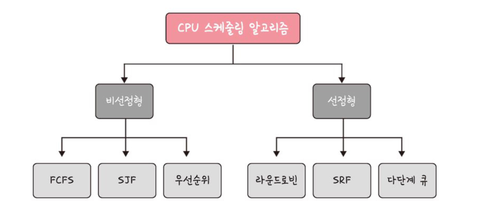

## 개요

- CPU 스케줄러는 **알고리즘**에 따라 프로세스에서 해야 할 일을 스레드 단위로 CPU에 할당한다

- 프로그램이 실행될 때는 알고리즘이 어떤 프로그램에 CPU 소유권을 줄 건지 결정한다
- 알고리즘의 목표
    - CPU 이용률은 높게
    - 주어진 시간에 많은 일을 하게
    - 준비 큐에 있는 프로세스는 적게
    - 응답시간은 짧게

## 비선점형 방식

프로세스가 스스로 CPU 소유권을 포기하는 방식(강제 중지 x)

컨텍스트 스위칭으로 인한 부하가 적다는 장점

### FCFS

- First Come First Served(선착순)
- 단점) 길게 수행되는 프로세스 때문에 준비 큐에서 오래 기다리는 현상 (convoy effect) 발생

### SJF

- Shortest Job First
- 단점) 긴 시간을 가진 프로세스는 실행되지 않는 현상(starvation) 발생
- 평균 대기시간이 가장 짧다

### 우선순위

- SJF 의 단점을 보완
- 오래된 작업일수록 우선순위를 높여(aging) 긴 시간을 가진 프로세스도 실행될 수 있도록 한다.

## 선점형 방식

현대 운영체제가 채택

지금 사용하고 있는 프로세스를 중단시키고, 다른 프로세스에 강제로 CPU 소유권을 할당하는 방식

### 라운드 로빈

- 우선순위 스케줄링의 일종
- 각 프로세스는 동일한 할당 시간을 주고, 그 시간 안에 끝나지 않으면 다시 준비 큐의 뒤로 가는 알고리즘
    - 할당 시간이 너무 크면 = FCFS
    - 너무 짧으면 컨텍스트 스위칭이 잦아져서 오버헤드 발생 (비용 증가)
- 전체 작업 시간은 길어지지만 평균 응답 시간은 짧아진다
- 로드밸런서에서 트래픽 분산 알고리즘으로도 쓰임

### SRF

SJF와 달리, 중간에 더 짧은 작업이 들어오면 현재 프로세스를 중지하고 해당 프로세스를 수행한다

### 다단계 큐

- 우선순위에 따른 준비 큐를 여러 개 사용하고, 큐마다 다른 스케줄링 알고리즘을 적용한 것
- 큐 간의 프로세스 이동이 안되므로 스케줄링 부담은 적지만, 유연성이 떨어짐