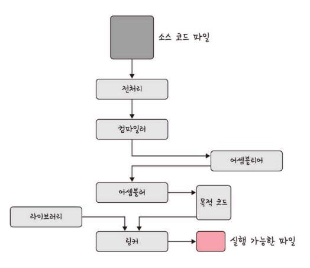
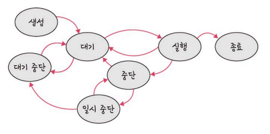
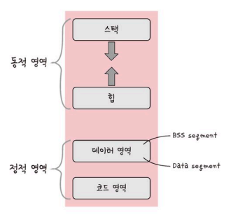
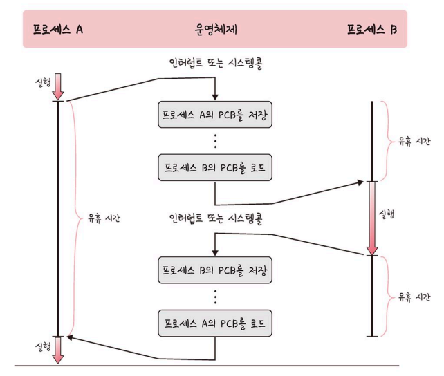
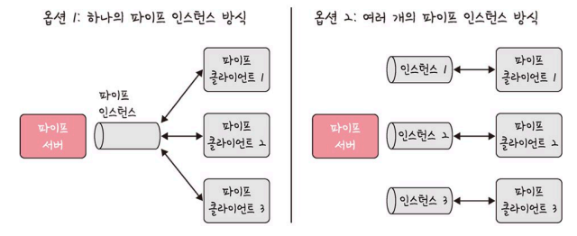

## 프로세스와 컴파일 과정

- 프로세스
    - 컴퓨터에서 실행되고 있는 프로그램
    - 프로그램으로부터 인스턴스화 된 것
        - *e.g. 프로그램은 실행파일 (확장자 .exe) → 클릭하면 프로세스 시작*
    - CPU 스케줄링의 대상이 되는 `작업` 과 거의 유사한 의미

- 동작과정
    1. 프로그램이 메모리에 올라감
    2. 인스턴스화 = 즉, 프로세스가 됨
    3. 이후 운영체제의 CPU 스케줄러에 따라 CPU가 프로세스를 실행

- 프로그램
    - 컴파일러가 **컴파일 과정**을 거쳐 컴퓨터가 이해할 수 있는 기계어로 번역되어 실행될 수 있는 파일이 된 것

### 프로그램의 컴파일 과정

C언어 기반의 프로그램 예시

- 전처리
    - 소스 코드의 주석을 제거하고 #include 등 헤더 파일을 병합하여 매크로를 치환
- 컴파일러
    - 오류 처리, 코드 최적화 작업을 하며 어셈블리어로 변환

- 어셈블러
    - 목적 코드로 변환됨
    - 확장자는 운영체제마다 다르다
        
        → 리눅스에서는 `.o`
        

- 링커
    - 프로그램 내의 **라이브러리 함수** 또는 다른 파일들과 목적 코드를 결합하여 실행 파일을 만든다.
        - 해당 실행 파일의 확장자는 `.exe` 또는 `.out`

<aside>

    💡 정적 라이브러리와 동적 라이브러리

    - 전자는 프로그램 빌드 시 라이브러리가 제공하는 모든 코드를 실행 파일에 넣는 방식 → 외부 의존도가 낮지만 코드 중복 등으로 메모리 효율성이 떨어짐
    - 후자는 프로그램 실행 시 필요할 때만 DLL 함수 정보를 통해 참조 → 메모리 효율성이 좋지만, 외부 의존도가 높아진다는 단점이 있다.

</aside>

## 프로세스의 상태

프로세스는 여러 가지 상태 값을 갖는다.

### 생성 상태

- Create
- 프로세스가 생성된 상태
- `fork()` 나 `exec()` 함수를 통해 생성 → PCB가 할당됨
    
    <aside>

        💡 fork 함수
        - 부모 프로세스의 주소 공간을 그대로 복사하며, 새로운 자식 프로세스를 생성하는 함수
        - 주소 공간만 복사. 비동기 작업 등은 상속되지 않는다.
        
        exec 함수
        - 새롭게 프로세스를 생성하는 함수

    </aside>
    

### 대기 상태

- Ready
- 메모리 공간이 충분하면 메모리를 할당 받고, 아니면 대기
- CPU 스케줄러로부터 CPU 소유권이 넘어오기를 기다리는 상태

### 대기 중단 상태

- Ready Suspended
- 메모리 부족으로 일시 중단된 상태

### 실행 상태

- Running
- CPU 소유권과 메모리를 할당받고 인스트럭션을 수행 중인 상태
- CPU burst 가 일어났다고도 표현함

### 중단 상태

- Blocked
- 어떤 이벤트가 발생한 이후 기다리며 프로세스가 차단된 상태
- 일반적으로 I/O 디바이스에 의한 인터럽트로 발생함

### 일시 중단 상태

- Blocked Suspended
- 대기 중단과 유사
- 중단된 상태에서 프로세스가 실행되려고 했지만, 메모리 부족으로 일시 중단된 상태

### 종료 상태

- Terminated
- 메모리와 CPU 소유권을 모두 놓고 감
- 자연스러운 종료, **비자발적 종료**가 있다.
    - 부모 프로세스가 자식 프로세스를 강제로 종료
- 할당된 자원의 한계치를 넘어서거나, 부모 프로세스가 종료되거나, 사용자가 프로세스 종료 명령어 수행 시 발생

## 프로세스의 메모리 구조

- 운영체제가 프로세스에 적절하게 메모리를 할당함
- 해당 구조 기반으로 할당 → 스택은 위 주소부터 할당되고, 힙은 아래 주소부터 할당된다.

    

### 스택

- **동적인 특징**을 갖는다.
    - 컴파일 시에 크기가 결정된다.
    - 함수가 함수를 재귀적으로 호출하면서 동적으로 크기가 늘어날 수 있다.
    - 힙과 스택의 메모리 영역이 겹치면 안 되기 때문에, 그 사이 공간을 비워둔다.
- 지역변수, 매개변수, 함수가 저장된다.

### 힙

- 동적 할당 시 사용
    - 런타임 시 크기가 결정된다.
    - e.g. 동적 배열인 힙 역시 동적 할당됨

### 데이터 영역

- 전역변수, 정적변수가 저장된다
- 정적인 특징을 갖는 프로그램이 종료되면 사라지는 변수가 들어있음
- BSS 영역과 Data 영역으로 나눈다.
    - BSS 영역 : 초기화가 되지 않은 변수가 0으로 초기화되어 저장됨
    - Data 영역 : 0이 아닌 다른 값으로 할당된 변수들이 저장됨

### 코드 영역

- 프로그램에 내장된 소스 코드가 들어가는 영역
- 수정 불가능한 기계어로 저장됨
- 정적인 특징 가짐

## PCB

### PCB 개요

Process Control Block

- 운영체제에서 프로세스에 대한 **메타데이터**를 저장한 데이터
    - 데이터에 관한 구조화된 데이터
    - 데이터를 설명하는 작은 데이터
    - 정보를 효율적으로 찾기 위해, 일정한 규칙에 따라 콘텐츠에 대해 부여되는 데이터
- 프로세스가 생성되면 운영체제는 해당 PCB를 생성함
- 프로세스의 중요한 정보를 포함하고 있기 때문에 접근 못하도록 커널 스택의 가장 앞부분에서 관리

### PCB의 구조

- 프로세스 스케줄링 상태 : 프로세스가 CPU에 대한 소유권을 얻은 이후의 상태
- 프로세스 ID : 자식 프로세스 ID 까지 포함
- 프로세스 권한 : 컴퓨터 자원 또는 I/O 디바이스에 대한 권한 정보
- 프로그램 카운터 : 프로세스에서 실행해야 할 다음 명령어 주소 포인터
- CPU 레지스터 : 프로세스를 실행하기 위해 저장해야 할 레지스터에 대한 정보
- CPU 스케줄링 정보 : CPU 스케줄러에 의해 중단된 시간 등에 대한 정보
- 계정 정보 : 프로세스 실행에 사용된 CPU 사용량, 실행한 유저의 정보
- I/O 상태 정보 : 프로세스에 할당된 I/O 디바이스 목록

### 컨텍스트 스위칭

- PCB를 교환하는 과정
- 한 프로세스에 할당된 시간이 끝나거나 인터럽트에 의해 발생
- 사실 프로세스는 한 개씩 실행됨 (싱글코어 기준)
    - 하지만 컨텍스트 스위칭이 아주 빠르게 실행되기 때문에 많은 프로세스가 동시에 구동되는 것처럼 보임

- 컨텍스트 스위칭 과정
    
    
    
    - 컨텍스트 스위칭이 일어나면서 유휴시간 발생 + 캐시미스 비용 발생
        
        <aside>
            
            💡 캐시미스란?
            프로세스가 가지고 있는 메모리의 주소가 그대로 있으면, 주소 변환 잘못되어 캐시클리어 과정을 겪게 되며 발생하는 비용
        
        </aside>
        

- 스레드에서의 컨텍스트 스위칭
    - 스레드는 스택 영역을 제외한 모든 메모리를 공유하기 때문에, 컨텍스트 스위칭에 들어가는 비용과 시간이 더 적다.

## 멀티프로세싱

### 멀티 프로세싱

- 여러 개의 프로세스를 통해 동시에 두 가지 이상의 일을 수행할 수 있는 것
- 병렬 처리 가능
- 특정 프로세스에 문제가 생겨도 다른 프로세스로 처리할 수 있어 신뢰성이 높다.

### 웹 브라우저

- 멀티프로세스 구조를 가지고 있음
- 브라우저 프로세스, 렌더러 프로세스, 플러그인 프로세스, GPU 프로세스가 한 번에 수행됨
    - 브라우저 프로세스 : 네트워크 요청이나 파일 접근 같은 권한 및 주소 표시줄, 북마크 막대, 뒤로 가기 버튼, 앞으로 가기 버튼 등을 담당
    - 렌더러 프로세스 : 웹 사이트 보이는 모든 것을 제어
    - 플러그인 프로세스 : 웹 사이트 플러그인 제어
    - GPU 프로세스 : GPU를 이용해서 화면을 그리는 부분 제어

### IPC

Inter Process Communication

- 프로세스끼리 데이터를 주고받고 공유 데이터를 관리하는 메커니즘
    - e.g. 클라이언트와 서버
- 메모리가 완전히 공유되는 스레드보다는 속도가 떨어짐

### IPC의 종류

- 공유 메모리
    - 여러 프로세스에 동일한 메모리 블록에 대한 접근 권한이 부여되어 프로세스가 서로 통신할 수 있도록 공유 버퍼를 생성하는 것
    - 여러 프로세스가 하나의 메모리를 공유할 수 있다
        - 메모리 자체를 공유하기 때문에 불필요한 데이터 복사의 오버헤드 발생 x
        - 가장 빠르다
        - 동기화가 필요하다
    - 하드웨어 관점에서는 RAM을 가리키기도 한다.

- 파일
    - 파일을 기반으로 프로세스 간 통신함

- 소켓
    - 동일한 컴퓨터의 다른 프로세스나, 네트워크의 다른 컴퓨터로 네트워크 인터페이스를 통해 전송하는 데이터
    - e.g. TCP, UDP

- 익명 파이프
    - 파이프 : 프로세스 간에 FIFO 방식으로 읽히는 임시공간
    - **파이프**를 기반으로 데이터를 주고 받음
        - 단방향 방식 (읽기전용, 쓰기전용)
        - 부모 자식 프로세스 간에만 사용 가능

- 명명된 파이프
    - 파이프 서버와 하나 이상의 파이프 클라이언트 간 통신을 위해 사용
    - 단방향 또는 이중 파이프
        - 클라이언트/서버 통신을 위한 별도의 파이프 제공
        - 여러 파이프 동시 사용 가능
        
            
        
        - 다른 네트워크상의 컴퓨터와도 통신 가능

- 메시지 큐
    - 메시지를 큐 데이터 구조로 관리하는 것
    - 커널에서 전역적으로 관리됨
    - 다른 방식에 비해 사용법이 직관적이고 간단하다
        - 쓰기 및 읽기 빈도가 높은 메시지를 관리하기 좋다

## 스레드와 멀티스레딩

### 스레드

- 프로세스의 실행 가능한 가장 작은 단위
- 코드, 데이터, 힙 스레드끼리 공유
    - 그 외는 각각 생성
    - cf. 코드, 데이터, 스택, 힙을 각각 생성하는 프로세스

### 멀티스레딩

- 프로세스 내 작업을 여러 개의 스레드로 처리하는 기법
- 스레드끼리 서로 자원을 공유하기 때문에 효율성이 높다.
    - 새 프로세스를 생성하는 대신 스레드를 사용하면 훨씬 적은 리소스 소비 + 중단되지 않는 빠른 처리 가능
- 동시성에도 장정이 있다
    - 하지만 동시에 접근하면 꼬여서 문제 발생 가능

### 임계 영역

- 둘 이상의 프로세스, 스레드가 공유 자원에 접근할 때 순서 등의 이유로 결과가 달라지는 코드 영역
- 해결 방법 : 뮤텍스, 세마포어, 모니터
    - `상호 배제`, `한정 대기`(특정 프로세스가 영원히 임계영역에 못들어가면 안됨), `융통성`(다른 프로세스의 일을 방해하면 안됨) 특징을 가짐
    - 잠금 메커니즘을 기반으로 함  (=하나가 쓰고 나서 쓴다)

**뮤텍스**

- 프로세스나 스레드가 공유자원을 lock() 을 통해 잠그고 사용 후에 unlock() 으로 잠금 해제하는 객체
- 잠금 또는 잠금 해제 상태만을 가진다

**세마포어**

- 일반화된 뮤텍스
- 간단한 정수값과 wait(P 함수) 및 signal(V 함수) 함수로 공유 자원에 대한 접근을 처리함
    - wait() 함수
        - 자신의 차례가 올 때까지 기다리는 함수
        - 프로세스나 스레드가 공유 자원에 접근 시 수행
    - signal()
        - 다음 프로세스로 순서를 넘겨주는 함수
        - 공유 자원을 해제하면 수행됨
- 조건 변수가 없음
- 프로세스나 스레드가 동시에 값을 수정할 수 없다.

**+) 바이너리 세마포어**

- 0과 1의 두 가지 값만 가지는 세마포어
- 뮤텍스와 유사하지만, 엄밀히 따지면 뮤텍스는 잠금 메커니즘을 기반으로 하고 바이너리 세마포어는 신호 메커니즘을 기반으로 한다는 점에서 차이가 있다.

**+) 카운팅 세마포어**

- 여러 개의 값을 가질 수 있는 세마포어
- 여러 자원에 대한 접근을 제어하는 데 사용

 

**모니터**

- 둘 이상의 스레드나 프로세스가 공유자원에 안전하게 접근하도록 공유자원을 숨기고 해당 접근에 대해 인터페이스만 제공한다.
- 모니터큐를 통해 공유 자원에 대한 작업들을 순차적으로 처리한다
- 구현이 쉽고, 상호 배제를 명시적으로 구현하지 않아도 된다
    - cf. 세마포어

## 교착 상태

두 개 이상의 프로세스가 서로가 가진 자원을 기다리며 중단된 상태

### 원인

- 상호 배제 : 한 프로세스가 자원을 독점함
- 점유 대기 : 특정 프로세스가 점유한 자원을 다른 프로세스가 요청함
- 비선점 : 다른 프로세스의 자원을 강제로 가져오지 못함
- 환형 대기 : 서로가 서로의 자원을 요구하는 상황

### 해결 방법

- 자원 할당 시 애초에 조건이 성립되지 않게 설계한다
- 은행원 알고리즘
    - 정의) 총 자원의 양과 현재 할당한 자원의 양을 기준으로 상태를 안정/불안정으로 나누고, 안정 상태로 가도록 자원을 할당하는 알고리즘
    - 교착 가능성이 없을 때만 자원을 할당하고, 요청할 자원의 최대치를 정해 자원 할당 가능 여부를 파악해서 할당한다
- 교착 상태 발생 시 사이클의 유무를 찾아보고, 있다면 관련 프로세스를 한 개씩 지운다
- **교착 상태 발생하면 작업을 종료한다 (’응답없음’ 을 띄운다)**
    - 발생 빈도에 비해 처리 비용이 커서 현재 이를 채택함