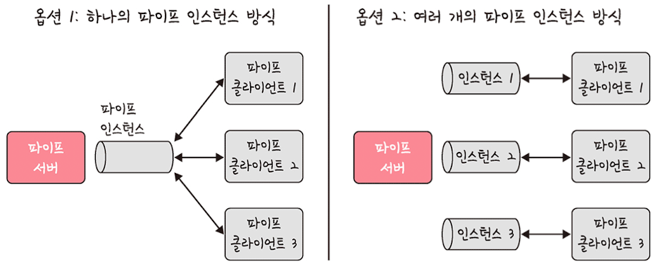

# 🧵 프로세스와 스레드

# 프로세스

- 프로세스(process)
    - 컴퓨터에서 실행되고 있는 프로그램
    - CPU 스케줄링의 대상이 되는 작업(task)이라는 용어와 거의 같은 의미로 쓰임
    - 프로그램으로부터 인스턴스화된 것
- 스레드
    - 프로세스 내 작업의 흐름
- 프로그램
    - 컴파일러가 `컴파일 과정`을 거쳐 컴퓨터가 이해할 수 있는 기계어로 번역되어 실행될 수 있는 파일이 되는 것
    - C언어 기반의 프로그램을 의미하며, 인터프리터 언어(파이썬 등)로 된 프로그램과 다름

# 컴파일 과정

## 전처리

- 소스 코드의 주석을 제거하고 헤더 파일을 병합하여 매크로를 치환

## 컴파일러

- 오류 처리, 코드 최적화 작업을 하며 어셈블리어로 변환

## 어셈블러

- 어셈블리어는 목적 코드(object code)로 변환
- 확장자는 운영체제마다 다름(리눅스에서는 .o)

## 링커

- 프로그램 내에 있는 `라이브러리` 함수 또는 다른 파일들과 목적 코드를 결합하여 실행 파일을 만듦
- 실행 파일의 확장자는 .exe 또는 .out

### 라이브러리

- 정적 라이브러리
    - 프로그램 빌드 시 라이브러리가 제공하는 모든 코드를 실행 파일에 넣는 방식
    - 시스템 환경 등 외부 의존도가 낮고 코드 중복 등 메모리 효율성이 떨어지는 단점
- 동적 라이브러리
    - 프로그램 실행 시 필요할 때만 DLL이라는 함수 정보를 통해 참조하는 방식
    - 메모리 효율성에서의 장점과 외부 의존도가 높아진다는 단점

# 프로세스의 상태

## create(생성 상태)

- 프로세스가 생성된 상태
- `fork()` 함수를 통해 생성
- PCB가 할당

```
💡 fork()

- 부모 프로세스의 주소 공간을 그대로 복사하며, 새로운 자식 프로세스를 생성하는 함수
- 주소 공간만 복사할 뿐이지, 부모 프로세스의 비동기 작업 등을 상속X
```

## ready(대기 상태)

- 메모리 공간이 충분하면 메모리를 할당받고 아니면 아닌 상태로 대기하고 있으며 CPU 스케줄러로부터 CPU 소유권이 넘어오기를 기다리는 상태

## ready suspended(대기 중단 상태)

- 메모리 부족으로 일시 중단된 상태

## running(실행 상태)

- CPU 소유권과 메모리를 할당받고 인스트럭션을 수행 중인 상태
- CPU burst가 일어났다고도 표현

## blocked(중단 상태)

- 어떤 이벤트가 발생한 이후 기다리며 프로세스가 차단된 상태
- 입출력 디바이스에 의한 인터럽트로 이런 현상이 많이 발생하기도 함

## blocked suspended(일시 중단 상태)

- 대기 중단과 유사
- 중단된 상태에서 프로세스가 실행되려고 했지만 메모리 부족으로 일시 중단된 상태

## terminated(종료 상태)

- 메모리와 CPU 소유권을 모두 놓고 가는 상태
- 종료는 자연스럽게 종료되는 것도 있지만, 부모 프로세스가 자식 프로세스를 강제시키는 비자발적 종료(abort)로 종료되는 것도 있음
- 자식 프로세스에 할당된 자원의 한계치를 넘어서거나, 부모 프로세스가 종료되거나, 사용자가 process.kill 등 여러 명령어로 프로세스를 종료할 때 발생

# 프로세스의 메모리 구조

## 스택(stack)

- 지역변수, 매개변수, 함수가 저장되고 컴파일 시에 크기가 결정
- 동적
- 함수가 함수를 재귀적으로 호출하면서 동적으로 크기가 늘어날 수 있는데, 이때 힙과 스택의 메모리 영역이 겹치면 안되기 때문에 힙과 스택 사이의 공간을 비워 놓음

## 힙(heap)

- 동적 할당할 때 사용되며 런타임 시 크기가 결정
- 동적

## 데이터 영역(BSS segment, Data segment)

- 전역변수, 정적변수가 저장
- 정적
- 프로그램이 종료되면 사라지는 변수가 들어 있는 영역
- `BSS 영역`
    - 초기화 되지 않은 변수가 0으로 초기화되어 저장
- `Data 영역`
    - 0이 아닌 다른 값으로 할당된 변수들이 저장

## 코드 영역(code segment)

- 프로그램에 내장되어 있는 소스 코드가 들어가는 영역
- 수정 불가능한 기계어로 저장
- 정적

# PCB(Process Control Block)

- 운영체제에서 프로세스에 대한 `메타데이터`를 저장한 ‘데이터’를 말함
- 프로세스 제어 블록
- 프로세스가 생성되면 운영체제는 해당 PCB를 생성

```
💡 메타데이터

- 데이터에 관한 구조화된 데이터
- 데이터를 설명하는 작은 데이터
- 대량의 정보 가운데에서 찾고 있는 정보를 효율적으로 찾아내서 이용하기 위해 일정한 규칙에 따라 콘텐츠에 대해 부여되는 데이터
```

## 구조

- 프로세스 스케줄링 상태
    - ‘준비’, ‘일시중단’ 등 프로세스가 CPU에 대한 소유권을 얻은 이후의 상태
- 프로세스 ID
    - 프로세스 ID, 해당 프로세스의 자식 프로세스 ID
- 프로세스 권한
    - 컴퓨터 자원 또는 입출력 디바이스에 대한 권한 정보
- 프로그램 카운터
    - 프로세스에서 실행해야 할 다음 명령어의 주소에 대한 포인터
- CPU 레지스터
    - 프로세스를 실행하기 위해 저장해야 할 레지스터에 대한 정보
- CPU 스케줄링 정보
    - CPU 스케줄러에 의해 중단된 시간 등에 대한 정보
- 계정 정보
    - 프로세스 실행에 사용된 CPU 사용량, 실행한 유저의 정보
- 입출력 상태 정보
    - 프로세스에 할당된 입출력 디바이스 목록

## 컨텍스트 스위칭(context switching)

- PCB를 교환하는 과정
- 한 프로세스에 할당된 시간이 끝나거나 인터럽트에 의해 발생
- (싱글코어 기준) 컴퓨터는 많은 프로그램을 동시에 실행하는 것처럼 보이지만 어떠한 시점에서 실행되고 있는 프로세스는 단 한 개이며, 많은 프로세스가 동시에 구동되는 것처럼 보이는 것은 다른 프로세스와의 컨텍스트 스위칭이 아주 빠른 속도로 실행되기 때문
- 컨텍스트 스위칭이 일어날 때 프로세스가 가지고 있는 메모리 주소가 그대로 있으면 잘못 주소 변환이 생기므로 캐시클리어 과정을 겪게 되고 이 때문에 `캐시미스`가 발생

### 스레드에서의 컨텍스트 스위칭

스레드는 스택 영역을 제외한 모든 메모리를 공유하기 때문에 스레드 컨텍스트 스위칭의 경우 비용이 더 적고 시간도 더 적게 걸림

# 멀티프로세싱

- 여러 개의 프로세스, 즉 멀티프로세스를 통해 동시에 두 가지 이상의 일을 수행할 수 있는 것
- 하나 이상의 일을 병렬로 처리할 수 있으며 특정 프로세스 메모리, 프로세스 중 일부에 문제가 발생되더라도 다른 프로세스를 이용해서 처리할 수 있으므로 신뢰성이 높은 강점

## 웹 브라우저

웹 브라우저는 다음과 같은 멀티프로세스 구조를 가지고 있음

- 브라우저 프로세스
    - 주소 표시줄, 북마크 막대, 뒤로가기 버튼, 앞으로가기 버튼 등을 담당하며 네트워크 요청이나 파일 접근 같은 권한을 담당
- 렌더러 프로세스
    - 웹 사이트가 보이는 부분의 모든 것을 제어
- 플러그인 프로세스
    - 웹 사이트에서 사용하는 플러그인을 제어
- GPU 프로세스
    - GPU를 이용해서 화면을 그리는 부분을 제어

## IPC

> `IPC(Inter Process Communication)`는 프로세스끼리 데이터를 주고받고 공유 데이터를 관리하는 메커니즘을 뜻함
> 
- 멀티프로세스는 IPC가 가능
- 예시 : 클라이언트는 데이터를 요청하고 서버는 클라이언트 요청에 응답
- 종류 : 공유 메모리, 파일, 소켓, 익명 파이프, 명명 파이프, 메시지 큐
    - 모두 메모리가 완전히 공유되는 스레드보다는 속도가 떨어짐

### 공유 메모리(shared memory)

- 여러 프로세스에 동일한 메모리 블록에 대한 접근 권한이 부여되어 프로세스가 서로 통신할 수 있도록 공유 버퍼를 생성하는 것
- 기본적으로 각 프로세스의 메모리를 다른 프로세스가 접근할 수 없지만 공유 메모리를 통해 여러 프로세스가 하나의 메모리를 공유
- IPC 방식 중 어떠한 매개체를 통해 데이터를 주고받는 것이 아닌 메모리 자체를 공유하기 때문에 불필요한 데이터 복사의 오버헤드가 발생하지 않아 가장 빠름
- 같은 메모리 영역을 여러 프로세스가 공유하기 때문에 동기화가 필요
- 하드웨어 관점에서 공유 메모리는 CPU가 접근할 수 있는 큰 랜덤 접근 메모리인 RAM을 가리키기도 함

### 파일

- 디스크에 저장된 데이터 또는 파일 서버에서 제공한 데이터
- 이를 기반으로 프로세스 간 통신

### 소켓

- 동일한 컴퓨터의 다른 프로세스나 네트워크의 다른 컴퓨터로 네트워크 인터페이스를 통해 전송하는 데이터
- TCP와 UDP가 있음

### 익명 파이프(unamed pipe)

- 프로세스 간에 FIFO 방식으로 읽히는 임시 공간인 파이프를 기반으로 데이터를 주고받으며, 단방향 방식의 읽기 전용, 쓰기 전용 파이프를 만들어서 작동하는 방식
- 부모, 자식 프로세스 간에만 사용할 수 있으며 다른 네트워크상에서는 사용이 불가능

### 명명된 파이프(named pipe)

- 파이프 서버와 하나 이상의 파이프 클라이언트 간의 통신을 위한 명명된 단방향 또는 이중 파이프
- 클라이언트/서버 통신을 위한 별도의 파이프를 제공
- 여러 파이프를 동시에 사용할 수 있음
- 컴퓨터의 프로세스끼리 또는 다른 네트워크상의 컴퓨터와도 통신을 할 수 있음
- 보통 서버용 파이프와 클라이언트용 파이프로 구분해서 작동
- 하나의 인스턴스를 열거나 여러 개의 인스턴스를 기반으로 통신



### 메시지 큐

- 메시지를 큐(queue) 데이터 구조 형태로 관리하는 것
- 커널의 전역변수 형태 등 커널에서 전역적으로 관리
- 다른 IPC 방식에 비해서 사용 방법이 매우 직관적이고 간단함
- 다른 코드 수정 없이 단지 몇 줄의 코드를 추가해 간단하게 메시지 큐에 접근할 수 있는 장점
- 공유 메모리를 통해 IPC를 구현할 때 쓰기 및 읽기 빈도가 높으면 동기화 때문에 기능을 구현하는 것이 매우 복잡해지는데, 이때 대안으로 메시지 큐를 사용

# 스레드

- 프로세스의 실행 가능한 가장 작은 단위
- 코드, 데이터, 힙은 스레드끼리 서로 공유

# 멀티스레딩

- 프로세스 내 작업을 여러 개의 스레드, 멀티스레드로 처리하는 기법
- 장점
    - 스레드끼리 서로 자원을 공유하기 때문에 효율성이 높음
    - 한 스레드가 중단(blocked)되어도 다른 스레드는 실행(running) 상태일 수 있기 때문에 중단되지 않은 빠른 처리가 가능
    - 동시성(서로 독립적인 작업들을 작은 단위로 나누도 동시에 실행되는 것처럼 보여주는 것)
- 단점
    - 한 스레드에 문제가 생기면 다른 스레드에도 영향을 끼쳐 스레드로 이루어져 있는 프로세스에 영향을 줄 수 있음
- 예 : 웹 브라우저의 렌더러 프로세스(메인 스레드, 워커 스레드, 컴포지터 스레드, 레스터 스레드)

# 공유 자원(shared resource)

- 시스템 안에서 각 프로세스, 스레드가 함께 접근할 수 있는 모니터, 프린터, 메모리, 파일, 데이터 등의 자원이나 변수 등을 의미
- `경쟁 상태(race condition)`
    - 공유 자원을 두 개 이상의 프로세스가 동시에 읽거나 쓰는 상황
    - 동시에 접근을 시도할 때 접근 타이밍이나 순서 등이 결과값에 영향을 줄 수 있는 상태

# 임계 영역(critical section)

- 둘 이상의 프로세스, 스레드가 공유 자원에 접근할 때 순서 등의 이유로 결과가 달라지는 코드 영역
- 임계 영역을 해결하기 위한 방법 : 뮤텍스, 세마포어, 모니터
    - 상호 배제, 한정 대기, 융통성이란 조건을 만족
        - 상호 배제 : 한 프로세스가 임계 영역에 들어갔을 때 다른 프로세스는 들어갈 수 없음
        - 한정 대기 : 특정 프로세스가 영원히 임계 영역에 들어가지 못하면 안 됨
        - 융통성 : 한 프로세스가 다른 프로세스의 일을 방해해서는 안 됨
    - 토대가 되는 메커니즘은 잠금(lock)

## 뮤텍스(mutex)

- 프로세스나 스레드가 공유 자원을 lock()을 통해 잠금 설정하고, 사용한 후에는 unlock()을 통해 잠금 해제하는 객체
- 잠금이 설정되면 다른 프로세스나 스레드는 잠긴 코드 영역에 접근할 수 없고 해제는 그와 반대
- 잠근 또는 잠금 해제라는 상태만을 가짐

## 세마포어(semaphore)

- 일반화된 뮤텍스
- 간단한 정수 값과 두 가지 함수 P() 함수(wait) 및 V() 함수(signal)로 공유 자원에 대한 접근을 처리
    - P() 함수는 자신의 차례가 올 때까지 기다리는 함수
    - V() 함수는 다음 프로세스로 순서를 넘겨주는 함수
- 프로세스나 스레드가 공유 자원에 접근하면 세마포어에서 wait 작업을 수행하고, 프로세스나 스레드가 공유 자원을 해제하면 세마포어에서 signal 작업을 수행
- 세마포어에는 조건 변수가 없고 프로세스나 스레드가 세마포어 값을 수정할 때 다른 프로세스나 스레드는 동시에 세마포어 값을 수정할 수 없음

### 바이너리 세마포어

- 0과 1의 두 가지 값만 가질 수 있는 세마포어
- 구현의 유사성으로 인해 뮤텍스는 바이너리 세마포어라고 할 수 있지만 엄밀히 말하면 뮤텍스는 잠금을 기반으로 상호배제가 일어나는 ‘잠금 메커니즘’이고, 세마포어는 신호를 기반으로 상호 배제가 일어나는 ‘신호 메커니즘’

### 카운팅 세마포어

- 여러 개의 값을 가질 수 있는 세마포어
- 여러 자원에 대한 접근을 제어하는 데 사용

## 모니터

- 둘 이상의 스레드나 프로세스가 공유 자원에 안전하게 접근할 수 있도록 공유 자원을 숨기고 해당 접근에 대해 인터페이스만 제공
- 모니터큐를 통해 공유 자원에 대한 작업들을 순차적으로 처리
- 세마포어보다 구현하기 쉬우며 모니터에서 상호 배제는 자동인 반면에, 세마포어에서는 상호 배제를 명시적으로 구현해야 함

# 교착 상태(deadlock)

두 개 이상의 프로세스들이 서로가 가진 자원을 기다리며 중단된 상태

## 원인

- 상호 배제 : 한 프로세스가 자원을 독점하고 있으며 다른 프로세스들은 접근이 불가능
- 점유 대기 : 특정 프로세스가 점유한 자원을 다른 프로세스가 요청하는 상태
- 비선점 : 다른 프로세스의 자원을 강제적으로 가져올 수 없음
- 환형 대기 : 프로세스들이 서로가 서로의 자원을 요구하는 상황

## 해결 방법

- 자원을 할당할 때 애초에 조건이 성립되지 않도록 설계
- 교착 상태 가능성이 없을 때만 자원 할당되며, 프로세스당 요청할 자원들의 최대치를 통해 자원 할당 가능 여부를 파악하는 `은행원 알고리즘` 사용
- 교착 상태가 발생하면 사이클이 있는지 찾아보고 이에 관련된 프로세스를 한 개씩 지움
- 교착 상태는 매울 드물게 일어나기 때문에 이를 처리하는 비용이 더 커서 교착 상태가 발생하면 사용자가 작업을 종료 (현대 운영체제는 이 방법을 채택)

```
💡 은행원 알고리즘

- 총 자원의 양과 현재 할당한 자원의 양을 기준으로 안정 또는 불안정 상태로 나누고 안정 상태로 가도록 자원을 할당하는 알고리즘
```