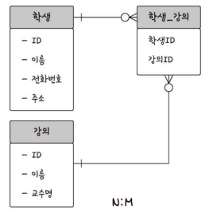

## 데이터베이스

- 데이터베이스 : 일정한 규칙 혹은 규약을 통해 구조화되어 저장되는 데이터의 모음
    - 실시간 접근과 동시 공유 가능
- DBMS : 데이터베이스를 제어 및 관리하는 통합 시스템

<aside>

    💡 데이터베이스의 데이터들은 특정 DBMS 마다 정의된 쿼리 언어를 통해 삽입, 삭제, 수정, 조회 수행

</aside>

- 구조
    - 데이터베이스 위에 DBMS
    - 그 위에 응용 프로그램
    
    e.g. MySQL(DBMS) 위의 응용프로그램 (Node.js, php) 에서 데이터베이스 안의 데이터를 꺼내 관련 로직 수행
    

## 엔터티

### 개요

- 엔터티 : 사람, 장소, 물건, 사건, 개념 등 여러 속성을 지닌 명사
    - 속성은 서비스의 요구 사항에 맞춰 정해진다.
    
    <aside>

        💡 속성
        릴레이션이 관리하는 구체적이고 고유한 이름을 갖는 정보
    
    </aside>
    

### 약한 엔터티와 강한 엔터티

- 엔터티는 약한 엔터티와 강한 엔터티로 구분된다.
- A가 B에 종속적인 경우 (=A가 혼자서는 존재하지 못하는 경우)
    - A는 약한 엔터티, B는 강한 엔터티

## 릴레이션

### 개요

- 릴레이션 : DB에서 정보를 구분하여 저장하는 기본 단위
    - 관계형 DB에서는 테이블
    - NoSQL DB에서는 컬렉션
- 엔터티에 관한 데이터를 릴레이션 하나에 담아서 관리한다.
- 엔터티가 DB에서 관리될 때, 릴레이션 이라고 한다.

### 테이블과 컬렉션

- 관계형 데이터베이스(MySQL) 와 No SQL 데이터베이스(MongoDB)는 구조가 다르다
    - 전자는 레코드-테이블-데이터베이스
    - 후자는 도큐먼트-컬렉션-데이터베이스
- 레코드(도큐먼트) 가 쌓여서 테이블(컬렉션)이 되고, 테이블이 쌓여서 DB 가 된다.

### 도메인

: 릴레이션에 포함된 각각의 속성들이 가질 수 있는 값의 집합

e.g. 성별 속성 → {남, 여}

## 필드와 레코드

### 개요

- 테이블은 필드와 레코드로 구성된다.
    
    
    
    - 레코드 = 튜플 = 테이블에 쌓이는 행 단위의 데이터

- ‘책’ 이라는 엔터티를 정의하고, 테이블을 만든다면?
    - 많은 속성들 중에서 필요한 속성만 선정
    - 속성에 맞는 타입 정의
    - 테이블화
        - 속성은 영어 이름에 매핑하여 사용한다

### 필드 타입

- 필드는 타입을 가지며, 타입은 DBMS마다 다르다.

**숫자 타입**

| 타입 | 용량(바이트) | 최솟값(부호o) | 최솟값(부호x) | 최댓값(부호x) | 최댓값(부호o) |
|---|----|----|----|----|----|
| TINYINT | 1 | -128 | 0 | 127 | 255 |
| SMALLINT | 2 | -32768 | 0 | 32767 | 65535 |
| MEDIUMINT | 3 | -8388608 | 0 | 8388607 | 16777215 |
| INT | 4 | -2147483648 | 0 | 2147483647 | 4294967295 |
| BIGINT | 8 | -263 | 0 | 263-1 | 263-1 |

**날짜 타입**

- DATE
    - 시간 부분은 없는 날짜 값
    - 용량 3byte
    - 1000-01-01 ~ 9999-12-31
- DATETIME
    - 날짜 + 시간
    - 용량 3byte
    - 1000-01-01 ~ 9999-12-31
- TIMESTAMP
    - 날짜 + 시간
    - 용량 4byte
    - 1970-01-01 00:00:01 ~ 2038-01-19 03:14:07

**문자 타입**

- CHAR 과 VARCHAR
    - 괄호 안의 숫자 = 몇 자까지 입력 가능한지
    - 전자는 테이블 생성시 선언한 길이로 고정됨
        - 길이는 0에서 255 사이
    - 후자는 가변 길이 문자열
        - 길이는 0에서 65535 사이
        - 입력된 데이터에 따라 용량 가변시켜 저장
        - 입력된 데이터 길이 + **1바이트 → 길이 기록용**
        - 유동적인 길이 가진 데이터 저장시 유리
- TEXT와 BLOB
    - 둘 다 큰 데이터 저장 시 사용
    - 전자는 큰 문자열 저장에 사용 e.g. 게시판 본문
    - 후자는 이미지, 동영상 등 큰 데이터 저장에 사용
        
        → 하지만 일반적으로 이미지 호스팅 서비스(e.g. S3)를 사용해서 서버에 올리고 그 경로만 VARCHAR 로 저장한다.
        
- ENUM과 SET
    - 문자열을 열거한 타입 (=리스트)
    - 전자는 단일 선택만 가능
        - 잘못된 값 삽입시 빈 문자열이 대신 삽입됨
        - 숫자로 매핑되어 메모리 적게 사용함
        - 최대 65535개 삽입 가능
    - 후자는 여러 개 선택 가능
        - 비트 단위 연산 가능
        - 최대 64개 요소 삽입 가능
    - 공간적으로는 이점이 있지만, 애플리케이션 수정 시 목록을 수정해야 한다는 단점

## 관계

### 개요

- 여러 개의 테이블 간 관계가 정의되어 있다
- 관계화살표로 표현됨
    
    

### 1:1 관계

e.g. 유저 - 유저 이메일

- 왜 쓰는가? 테이블을 두 개로 나눠 구조 이해 쉬움

### 1:N 관계

e.g. 유저 - (장바구니에 담은)상품

- 위 예시에서는 0도 포함되는 화살표를 써야 한다.
- 한 개체가 다른 많은 개체 포함하는 관계

### N:M 관계

e.g. 학생 - 강의 → 학생도 여러 강의 수강 가능, 강의도 여러 학생 포함 가능

- 테이블 두 개를 직접적으로 연결은 x
- 각각 테이블에 1:N, 1:M 관계를 갖는 테이블 하나를 추가해서 설정
    
  

## 키

### 키

- 테이블 간 관계를 명확히 하고, 테이블 내부의 인덱스를 위해 설정된 장치
- 키 간의 관계
    
    
    
    - 슈퍼키는 **유일성**을 가진다
        - 중복 x
    - 후보키는 유일성+**최소성**
        - 필드 조합 x
        - 최소 필드만 써서 키 형성 가능
    - 후보키 중 기본키로 선택되지 못한 경우 대체키

### 기본키

= PK (Primary Key)

- 유일성과 최소성을 만족
- 고유하게 존재하는 속성
- 복합키는 기본키가 될 수 없다 → 최소성에 어긋남
- 자연키 또는 인조키 중 골라 설정
    - 자연키 : 중복된 속성들을 제외해보니 남는 키. 언젠가는 변한다.
    - 인조키
        - 인위적으로 부여한 키 → 고유 식별자 생겨남.
        - 오라클은 sequence, MySQL은 auto increment로 설정
        - 변하지 않기 때문에 일반적으로 인조키를 기본키로 한다.

### 후보키

- 기본키가 될 수 있는 후보들

### 대체키

- 후보키가 두 개 이상인 경우, 기본키 지정 후 남은 후보키

### 외래키

= FK(Foreign Key)

- 다른 테이블의 기본키를 참조하는 키
- 개체와의 관계 식별하는 데 사용
- 중복 허용

### 슈퍼키

- 각 레코드를 유일하게 식별할 수 있는 유일성을 갖춘 키