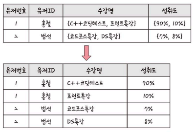

## ERD의 중요성

- ERD(Entity Relationship Diagram)
    - 데이터베이스 구축의 뼈대
    - 릴레이션 간 관계를 정의한 것
    - 시스템의 요구사항을 기반으로 작성
    - DB 구축 이후에도 디버깅 또는 프로세스 재설계가 필요한 경우 설계도 역할을 하기도 함
- 단점 → 관계형 구조로 표현 가능한 경우 유용하지만, 비정형 데이터의 경우 충분히 표현할 수 없다
    
    <aside>
        
        💡 비정형 데이터
        
        = 비구조화 데이터
        
        미리 정의된 데이터 모델이 없거나, 미리 정의된 방식으로 정리되지 않은 정보
    
    </aside>
    

## 예제로 배우는 ERD

### 승원 영업부서

- 요구사항
    - 영업사원은 0~N명의 고객을 관리한다
    - 고객은 0~N개의 주문을 넣을 수 있다.
    - 주문에는 1~N개의 상품이 들어간다.
- 결과

    

### 무무오브레전드

- 요구사항
    - 선수들은 1명의 챔피언을 고를 수 있다.
    - 챔피언은 한 개 이상의 스킬을 갖는다.
    - 스킬은 한 개 이상의 특성을 갖는다.
- 결과
    
    
    

## 정규화 과정

### 정규화 과정

- 릴레이션을 여러 개로 분리하는 과정
    - 왜 하는가?
        - 릴레이션 간 잘못된 종속 관계로 인해 생긴 문제 해결
        - 저장 공간을 효율적으로 사용하기 위해
    - 잘못된 종속 관계?
        - 하나의 속성만 가져야 하는데 여러 개를 갖거나
        - 삭제시 필요한 데이터가 같이 삭제되거나
        - 하나의 필드값이 NULL이 되면 안돼서 삽입이 안되는 등의 현상
    - 단점
        - 테이블을 나누기 때문에 조인 처리를 해야 해서 성능이 무조건 좋아진다고는 할 수 없다.
        - 서비스에 따라 반대로 비정규화 과정을 진행해야 할 수 있다.
- 정규성 원칙을 기반으로 정규형을 만들어간다
    - 정규형(NF) : 정규화된 정도를 표현
    - 기본 정규형 → 제1정규형, 제2정규형, 제3정규형, 보이스/코드 정규형
    - 고급 정규형 → 제4정규형, 제5정규형

### 정규형 원칙

- 좀 더 좋은 구조로
- 자료의 중복성 적게
- 독립적인 관계는 별개의 릴레이션으로
- 각각의 릴레이션은 독립적인 표현이 가능하게

### 제1정규형

- 릴레이션의 모든 도메인이 더 이상 분해될 수 없는 원자값으로만 구성되게 하는 것
- 즉, 속성 값 중에서 한 개의 기본키에 대해 두 개 이상의 값을 가지는 반복집합이 있으면 안된다.

    

### 제2정규형

- 릴레이션이 제1정규형이며, **부분함수의 종속성을 제거**한 형태
    - 기본키가 아닌 모든 속성이 기본키에 완전 함수종속적인 것

    

- 제1정규화 수행된 테이블을 **두 개의 릴레이션**으로 분리
    1. 기본키인 {유저ID, 수강명} 과 완전 종속된 유저번호 릴레이션
    2. 기본키에 따른 성취도 
- 주의할 점
    - 동등한 릴레이션으로 분해해야 한다
    - 무손실 분해(정보 손실 x) 로 분해해야 한다.

### 제3정규형

- 제2정규형이면서 기본키가 아닌 모든 속성이 이행적 함수 종속을 만족하지 않는 상태
- 이행적 함수 종속
    - A → B 이고 B → C일 때 논리적으로 A → C 가 성립한다
    - 이 때 집합 C가 집합 A에 이행적으로 함수 종속이 되었다.

    

- 원래 유저ID → 등급 이고 등급 → 할인율
    - 논리적으로 유저ID → 할인율
    - 따라서 둘을 분리한다.

### 보이스/코드 정규형

- 제3정규형이면서 결정자가 후보키가 아닌 함수 종속 관계를 제거한 상태
- 즉, 릴레이션의 함수 종속 관계에서 모든 결정자가 후보키이다.

<aside>

    💡 결정자

    함수 종속 관계에서 특정 종속자를 결정짓는 요소

    e.g. X → Y일 때 X는 결정자, Y는 종속자

</aside>

- 예시
    - 요구사항
        - 각 수강명에 대해 한 학생은 오직 한 강사의 강의만 수강한다.
        - 각 강사는 한 수강명만 담당한다.
        - 한 수강명은 여러 강사가 담당할 수 있다.
    - 릴레이션
        
        
        
        - 후보키 = {학번, 수강명} 또는 {학번, 강사}
        - 강사 속성이 결정자 이지만, 후보키가 아니므로 강사 속성을 분리해야 한다.