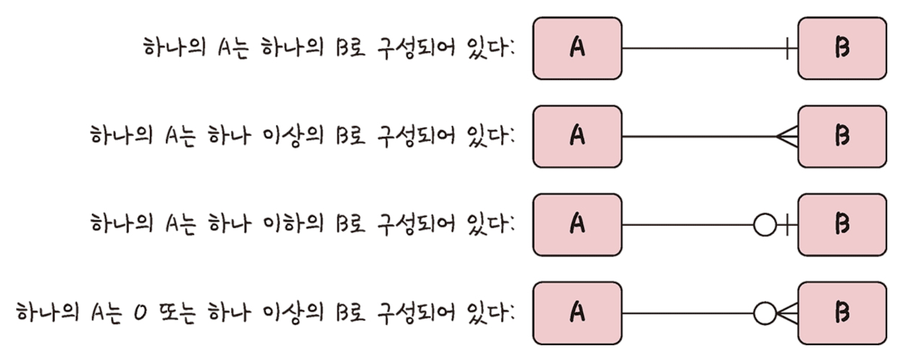
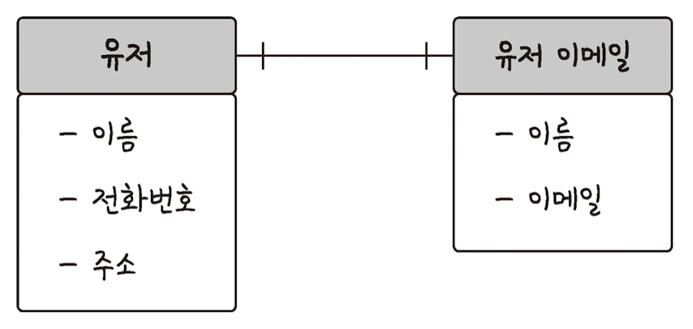
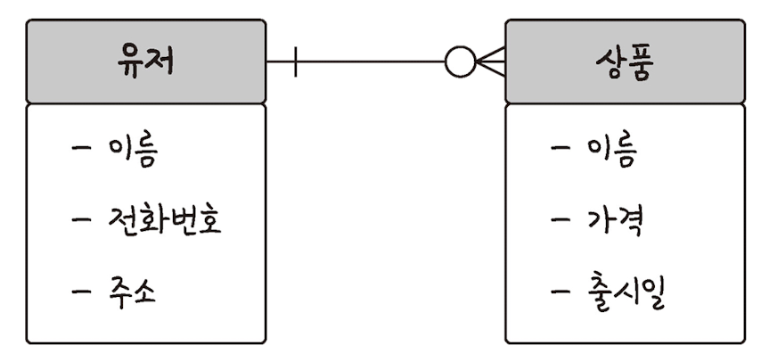
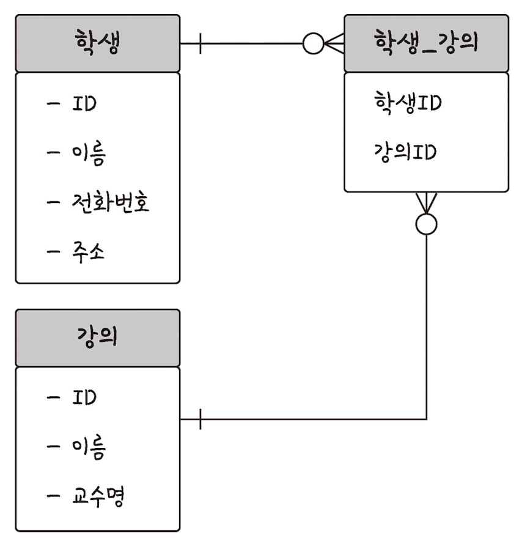
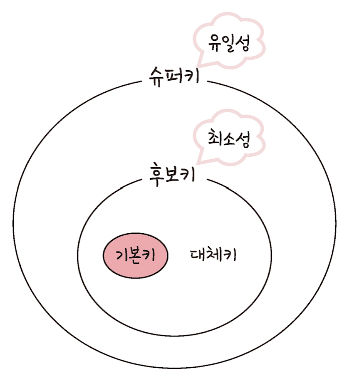

# 🗂️ 데이터베이스의 기본

- 데이터베이스(DB, DataBase)
    - 일정한 규칙, 혹은 규약을 통해 구조화되어 저장되는 데이터의 모음
    - 실시간 접근과 동시 공유가 가능
- DBMS(DataBase Management System)
    - 데이터베이스를 제어, 관리하는 통합 시스템
- 데이터베이스 안에 있는 데이터들은 특정 DBMS마다 정의된 쿼리 언어(query language)를 통해 삽입, 삭제, 수정, 조회 등을 수행할 수 있음
- 데이터베이스 위에 DBMS가 있고 그 위에 응용 프로그램이 있으며, 이러한 구조를 기반으로 데이터를 주고 받음

# 엔터티(entity)

- 사람, 장소, 물건, 사건, 개념 등 여러 개의 속성을 지닌 명사
- 서비스 요구 사항에 맞춰 속성이 정해짐
- 강한 엔터티 / 약한 엔터티(종속적)

# 릴레이션(relation)

- 데이터베이스에서 정보를 구분하여 저장하는 기본 단위
- 엔터티에 관한 데이터를 릴레이션 하나에 담아서 관리(엔터티가 DB에서 관리될 때 릴레이션으로 변화)
- 릴레이션은 관계형 DB에서는 `테이블`이라고 하며, NoSQL DB에서는 `컬렉션`이라고 함

## 테이블과 컬렉션

DB의 종류는 크게 관계형 데이터베이스와 NoSQL 데이터베이스로 나눌 수 있음

- 관계형 데이터베이스
    - MySQL
    - 레코드 → 테이블 → 데이터베이스 구조
- NoSQL 데이터베이스
    - MongoDB
    - 도큐먼트 → 컬렉션 → 데이터베이스 구조

# 속성(attribute)

- 릴레이션에서 관리하는 구체적이며 고유한 이름을 갖는 정보
- 서비스의 요구 사항을 기반으로 관리해야 할 필요가 있는 속성들만 엔터티의 속성이 됨

# 도메인(domain)

- 릴레이션에 포함된 각각의 속성들이 가질 수 있는 값의 집합

# 필드와 레코드

- 테이블에 쌓이는 행(row) 단위의 데이터를 `레코드` 또는 튜플이라고 함

## 필드 타입

### 숫자 타입

| 타입 | 용량(바이트) |
| --- | --- |
| TINYINT | 1 |
| SAMLLINT | 2 |
| MEDIUMINT |  3 |
| INT | 4 |
|  BIGINT | 8 |

### 날짜 타입

| 타입 | 설명 | 지원되는 범위 | 용량(바이트) |
| --- | --- | --- | --- |
| DATE | 날짜 부분은 있지만 시간 부분은 없는 값에 사용 | `1000-01-01` ~ `9999-12-31` | 3 |
| DATETIME | 날짜 및 시간 부분을 모두 포함하는 값에 사용 | `1000-01-01 00:00:00` ~ `9999-12-31 23:59:59` | 8 |
| TIMESTAMP | 날짜 및 시간 부분을 모두 포함하는 값에 사용 | `1970-01-01 00:00:01` ~ `2038-01-19 03:14:07` | 4 |

### 문자 타입

- <b>CHAR와 VARCHAR</b>
    - 수를 입력해서 몇 자까지 입력할지 정함
    - `CHAR`
        - 테이블을 생성할 때 선언한 길이로 고정되며 길이는 0에서 255 사이의 값을 가짐
        - 레코드를 저장할 때 무조건 선언한 길이 값으로 고정해서 저장
        - 유동적이지 않은 길이를 가진 데이터의 경우에 효율적
    - `VARCHAR`
        - 가변 길이 문자열
        - 길이는 0에서 65,535 사이의 값으로 지정할 수 있으며, 입력된 데이터에 따라 용량을 가변시켜 저장
        - 글자에 해당하는 바이트 + 길이기록용 1바이트로 저장하게 됨
        - 유동적인 길이를 가진 데이터
- <b>TEXT와 BLOB</b>
    - 큰 데이터를 저장할 때 쓰는 타입
    - `TEXT`
        - 문자열 저장에 쓰며 주로 게시판의 본문을 저장할 때 씀
    - `BLOB`
        - 이미지, 동영상 등 큰 데이터 저장에 쓰임
        - 보통은 아마존의 이미지 호스팅 서비스인 S3를 이용하는 등 서버에 파일을 올리고 파일에 관한 경로를 VARCHAR로 저장
- <b>ENUM와 SET</b>
    - 문자열을 열거한 타입
    - 공간적으로 이점을 볼 수 있지만 애플리케이션의 수정에 따라 데이터베이스의 ENUM이나 SET에서 정의한 목록을 수정해야 함
    - `ENUM`
        - x-small, small, medium, large, x-large 형태로 쓰이며, 이 중에서 하나만 선택 가능하고 리스트에 없는 잘못된 값을 삽입하면 빈 문자열일 대신 삽입
        - 메모리를 적게 사용하는 이점
        - 최대 65,535개의 요소를 넣을 수 있음
    - `SET`
        - 여러 개의 데이터를 선택할 수 있고 비트 단위의 연산을 할 수 있으며 최대 64개의 요소를 집어 넣을 수 있음

# 관계

- 데이터베이스에 여러 개의 테이블이 있고 이러한 테이블은 서로의 관계가 정의되어 있음
- 이러한 관계는 관계화살표로 나타냄
    

    

## 1:1 관계

- 1:1 관계는 테이블을 두 개의 테이블로 나눠 테이블의 구조를 더 이해하기 쉽게 만들어 줌

## 1:N 관계

- 0도 포함되는 화살표를 통해 표현

## N:M 관계

- N:M은 테이블 두 개를 직접적으로 연결해서 구축하지 않고, 1:N, 1:M이라는 관계를 갖는 테이블 두 개로 나눠서 설정

# 키(Key)

- 테이블 간의 관계를 조금 더 명확하게 하고 테이블 자체의 인덱스를 위해 설정된 장치
- 기본키, 외래키, 후보키, 슈퍼키, 대체키가 있음
    

    
- 슈퍼키는 유일성이 있고, 그 안에 포함된 후보키는 최소성까지 갖춤
- 후보키 중에서 기본키로 선택되지 못한 키는 대체키가 됨
- `유일성`은 중복되는 값은 없으며, `최소성`은 필드를 조합하지 않고 최소 필드만 써서 키를 형성할 수 있는 것

## 기본키(Primary Key, PK, 프라이머리키)

- 유일성과 최소성을 만족하는 키
- 테이블의 데이터 중 고유하게 존재하는 속성
- 기본키에 해당하는 데이터는 중복되면 안됨
- 복합키를 기본키로 설정하면 최소성을 만족하지 않음
- `자연키` 또는 `인조키` 중에 골라 설정

### 자연키

- 중복된 값들을 제외하며 중복되지 않는 것을 자연스레 뽑다가 나오는 키
- 언젠가는 변하는 속성을 가짐

### 인조키

- 인위적으로 생성한 키
- 자연키와 대조적으로 변하지 않음
- 보통 기본키는 인조키로 설정

## 외래키(Foreign Key, FK)

- 다른 테이블의 기본키를 그대로 참조하는 값으로 개체와의 관계를 식별하는 데 사용
- 중복 가능

## 후보키(candidate key)

- 기본키가 될 수 있는 후보
- 유일성과 최소성을 동시에 만족하는 키

## 대체키(alternate key)

- 후보키가 두 개 이상일 경우 어느 하나를 기본키로 지정하고 남은 후보키

## 슈퍼키(super key)

- 각 레코드를 유일하게 식별할 수 있는 유일성을 갖춘 키