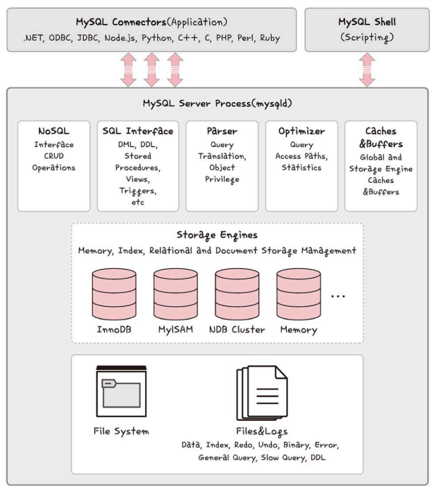

## 관계형 데이터베이스

### 개요

- 관계형 데이터베이스 = RDBMS
- 행과 열을 가지는 표 형식 데이터를 저장하는 형태의 DB
- SQL 언어를 사용하여 조작한다
    - MySQL, PostgreSQL, 오라클, SQL Server, MSSQL 등이 있음
    - 각각 제품에 특화시킨 SQL을 사용한다

### MySQL

- 대부분의 운영체제와 호환된다. 가장 많이 사용함
- C, C++로 만들어짐
- 대용량 DB를 위해 설계되어 있음

- 스토리지 엔진 아키텍처
    
    

    - 스토리지 엔진 = 데이터베이스의 심장
    - 모듈식 아키텍처로 쉽게 교체 가능
    - 데이터 웨어하우징, 트랜잭션 처리, 고가용성 처리에 강점
    - 커넥터 API, 서비스 계층을 통해 DB와 쉽게 상호작용 가능
    - 쿼리 캐시 지원 → 동일한 쿼리 작성시 실행 건너뛰고 캐시에 있는 출력만 보여준다.

### PostgreSQL

- VACUUM 이 특징
    - 디스크 조각이 차지하는 영역을 회수할 수 있는 장치
- SQL 뿐만 아니라 JSON 이용해서 데이터에 접근 가능
- 복구 기능, 로깅, 접근 제어, 중첩 트랜잭션, 백업 기능

## NoSQL 데이터베이스

NoSQL = Not only SQL

### MongoDB

- JSON 통해 데이터에 접근 가능
- Binary JSON 형태로 데이터가 저장됨
- 와이어드타이거 엔진이 기본 스토리지 엔진으로 장착된 키-값 데이터 모델에서 확장된 도큐먼트 기반의 DB

- 확장성이 뛰어남
- 빅데이터 저장시 성능이 좋음
- 고가용성, 샤딩, 레플리카셋을 지원
- 스키마 정하지 않고도 데이터 삽입이 가능하기 때문에 다양한 도메인의 DB 분석이나 로깅 등을 구현시 강점

- 도큐먼트 생성할 때마다 유니크한 ObjectID 생성됨
    - 다른 컬렉션과 중복된 값이 잘 생기지 x
    - 기본키
    - 타임스탬프(4바이트) + 랜덤 값(5바이트) + 카운터(3바이트) 로 이루어짐

### redis

- 인메모리 데이터베이스
- 키-값 데이터 모델 기반의 DB
- 기본적인 데이터 타입 문자열
- 셋, 해시 등 지원

- 활용
    - pub/sub 기능을 통해 채팅 시스템
    - 캐싱 계층 (다른 DB 앞단에 두고 사용)
    - 세션 정보 관리(단순 키-값이 필요)
    - 정렬된 셋 자료구조를 이용한 실시간 순위표 서비스에 사용한다.