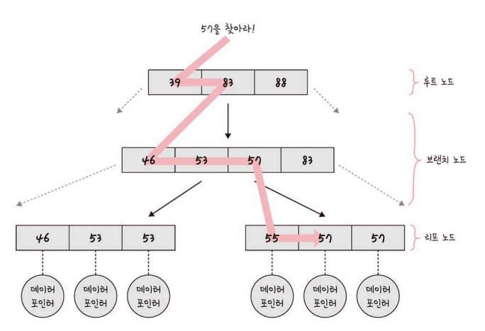

## B-트리

인덱스 = 데이터를 빠르게 찾을 수 있는 장치

인덱스는 보통 **B-트리 자료구조**로 이루어져 있다.

### B-트리 자료구조

- 루트노드 + 리프노드 + 브랜치노드

    

- 전체 탐색 x
- 찾는 대상이 있을 법한 리프노드로 들어가서 탐색한다.
- 정렬된 값을 기반으로 탐색 + `≤` 기반으로 57이라는 숫자를 찾는다

### 인덱스가 효율적인 이유와 대수확장성

- 인덱스가 효율적인 이유?
    - 효율적인 단계를 거쳐 모든 요소에 접근할 수 있는 균형 잡힌 트리 구조와 트리 깊이의 대수확장성 때문
- 대수확장성?
    - 트리 깊이가 리프 노드 수에 비해 매우 느리게 성장하는 것
    - 기본적으로 인덱스 depth 가 하나 증가할 때마다 인덱스 항목의 수는 최대 4배 증가한다
    - e.g. 트리 깊이가 10이면 100만개의 레코드 검색이 가능

## 인덱스 만드는 방법

DB마다 다르다

### MySQL

- 클러스터형 인덱스와 세컨더리 인덱스를 가진다
- 클러스터형 인덱스
    - 테이블 당 하나 설정 가능
    - 기본키로 만들 수도 있고, 기본키가 아니더라도 `unique not null` 옵션 붙여서 클러스터형 인덱스로 만들 수 있다

- 세컨더리 인덱스
    - `create index` 명령어로 만든다.
    - 하나만 만들거라면 클러스터형 인덱스 써라
        
        → 세컨더리 인덱스는 보조 인덱스로 여러 필드 값을 기반으로 쿼리를 많이 보낼 때 생성한는 인덱스이기 때문
        

### MongoDB

- 도큐먼트 만들면 자동으로 ObjectID 형성되고, 해당 키가 기본키로 설정된다.
- 세컨더리 키 부가적으로 설정하여 복합 인덱스 생성 가능

## 인덱스 최적화 기법

DB가 달라도 기본적인 골자는 유사

### 인덱스는 비용이다

- 인덱스를 지정하게 되면 탐색이 두 번 일어나야 하고, 컬렉션에 맞게 인덱스도 수정되어야 한다.
- 따라서 인덱스 무작정 설정 x
- 컬렉션에서 가져와야 하는 양이 많을수록 인덱스 사용이 비효율적

### 항상 테스팅하라

- 인덱스 최적화 기법은 서비스 특징에 따라 다름
    - 객체의 깊이, 테이블의 양 등이 다르기 때문
- explain() 함수로 테스팅할 수 있다.

### 복합 인덱스는 같음, 정렬, 다중값, 카디널리티 순이다

- 복합 인덱스 → 여러 필드 기반으로 조회할 때 생성
    - 생성 순서에 따라 인덱스 성능이 달라진다.
    - 같음 > 정렬 > 다중 값 > 카디널리티 순으로 생성해야 성능이 좋다

<aside>

    💡 카디널리티

    유니크한 값의 정도

    카디널리티가 높은 순서를 기반으로 인덱스 생성해야 한다

    즉, 중복될 확률이 적은 값을 가진 필드에 대한 인덱스를 먼저 생성해야 한다.

</aside>