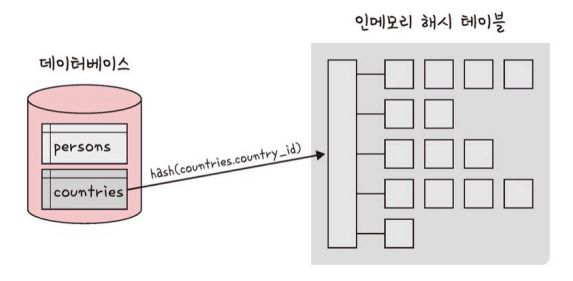
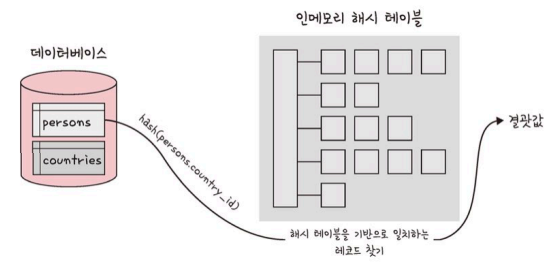

## 조인의 종류

<aside>

    💡 조인

    두 개 이상의 테이블을 묶어서 하나의 결과물을 만드는 것

    MySQL 에서는 JOIN 으로, MongoDB에서는 lookup 쿼리로 처리한다

    +) MongoDB의 lookup은 성능이 떨어져서 사용 x

</aside>

### 내부 조인

- 왼쪽 테이블과 오른쪽 테이블의 두 행이 **모두 일치하는 행**이 있는 부분만 표기
- INNER JOIN

### 왼쪽 조인

- 왼쪽 테이블의 모든 행이 결과 테이블에 표기된다.
- 오른쪽 테이블에 일치하는 항목이 없으면 해당 값은 null 로 채워진다.
- LEFT JOIN

### 오른쪽 조인

- 오른쪽 테이블의 모든 행이 결과 테이블에 표기된다.
- 왼쪽 테이블에 일치하는 항목이 없으면 해당 값은 null 로 채워진다.
- RIGHT JOIN

### 합집합 조인

- 조인 조건에 만족하지 않는 행까지 모두 표기한다.
- 일치하는 항목이 없으면 해당 값은 null 로 채워진다.
- FULL OUTER JOIN

## 조인의 원리

### 중첩 루프 조인

Nested Loop Join

- 중첩 for문과 같은 원리를 사용한다
    - 각 테이블에서 행을 하나씩 읽어와서 조건에 맞는지 체크해서 결과값 반환한다.
- 랜덤 접근에 대한 비용이 많이 증가하므로 대용량 테이블에서는 사용 x

- 블록 중첩 루프 조인
    - 조인할 테이블을 작은 블록으로 나눠서 블록을 하나씩 조인하는 방법
    - 중첩 루프 조인에서 발전

### 정렬 병합 조인

- 각각의 테이블을 조인할 필드 기준으로 정렬 → 조인 작업 수행
- 조인에 쓸 만한 인덱스가 없는 경우, 대용량의 테이블을 조인할 경우, 조인 조건으로 범위 비교 연산자(`<`, `>`) 가 있을 때 사용

### 해시 조인

- 해시 테이블을 기반으로 조인
- 두 개 테이블 조인시, 한 테이블이 메모리에 온전히 들어간다면 중첩 루프 조인보다 효율적임
- 동등 조인에서만 사용 가능

- 해시 조인의 단계
    - 빌드 단계
        
        
        
        - 입력 테이블 중 하나를 기반으로 메모리 내 해시 테이블을 빌드하는 단계
        - 둘 중에 바이트가 더 작은 테이블을 기반으로 한다
            
            → 조인에 사용되는 필드가 해시 테이블에 키로 사용된다
            
    - 프로브 단계
        
        

        - 레코드 읽기 시작
        - 각 레코드에서 일치하는 레코드를 찾아서 결과값으로 반환한다.
        - 테이블을 한 번씩만 읽기 때문에 중첩 루프 조인보다 성능이 더 좋다
        - 사용 가능한 메모리 양은 런타임 시에 조정 가능하다.